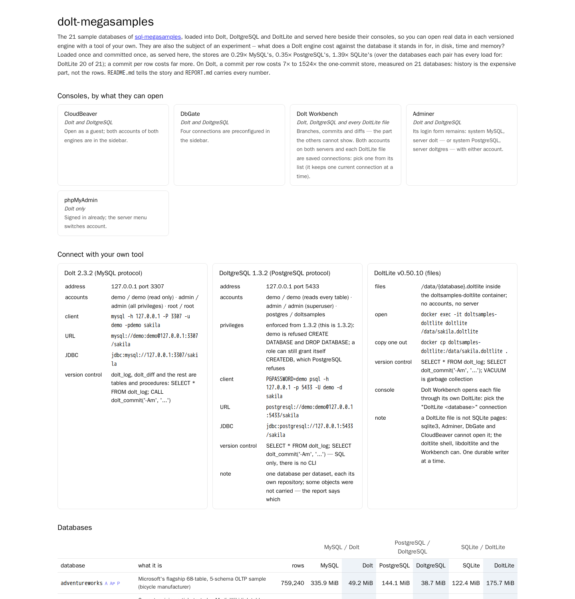
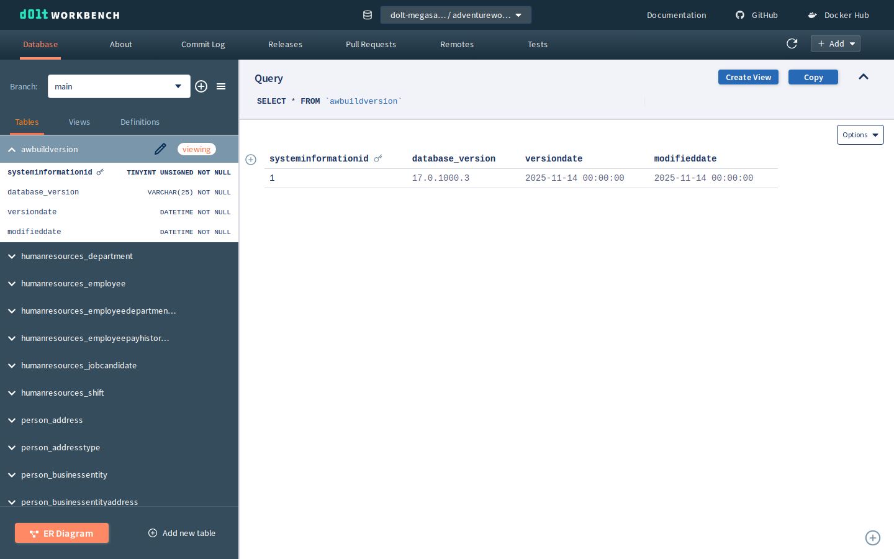
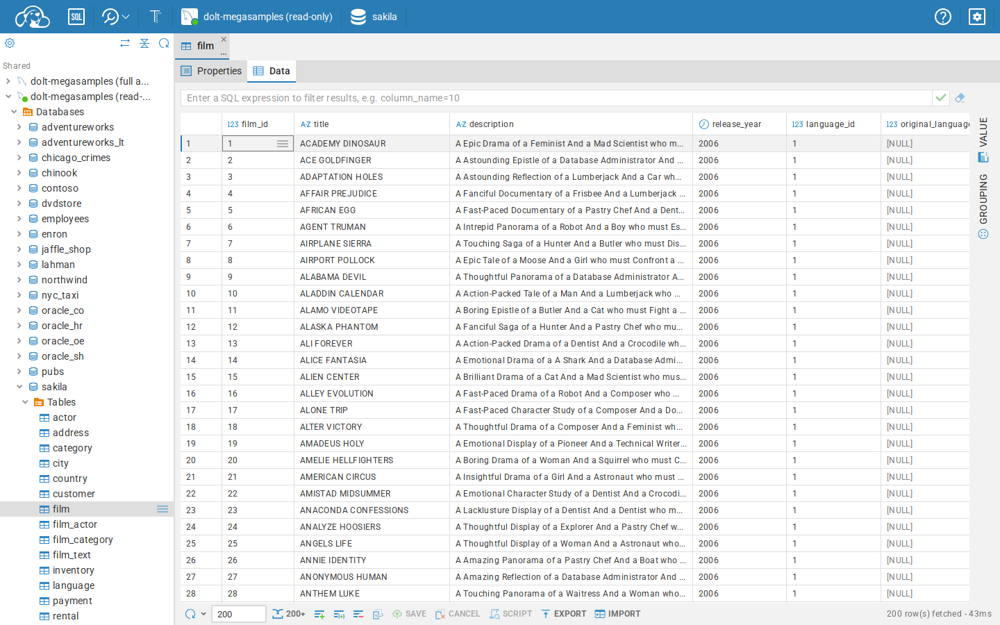
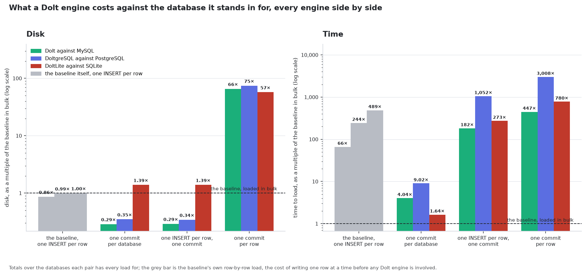
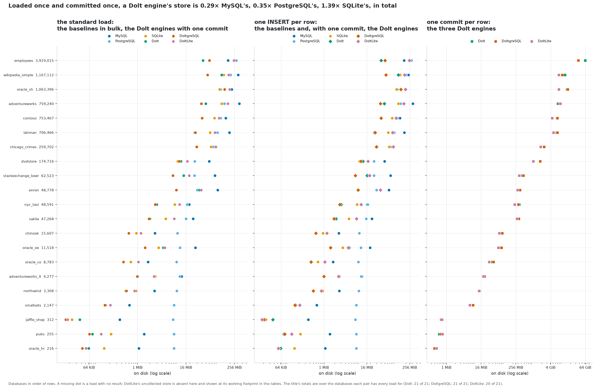
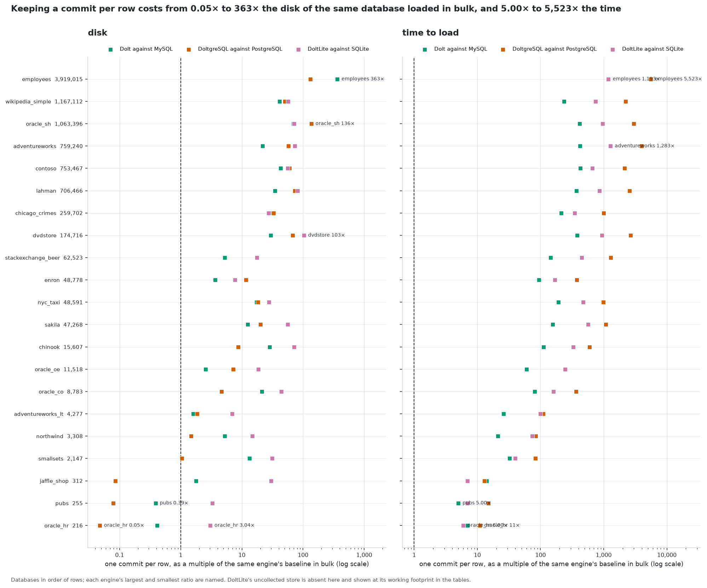
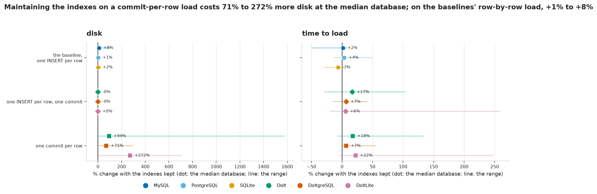

<!-- Generated by scripts/render.py from docs/templates/README.md and the files in
     build/. Do not edit this file: `make docs` overwrites it, and every number
     in it comes from a measurement rather than from anyone's memory. -->

# dolt-megasamples

**HUMAN NOTE**: This experiment was heavily AI driven and influenced and has only received "moderate" human oversight, and has not been peer reviewed.
PLEASE VERIFY THE FINDINGS YOU TAKE AWAY FROM THIS.

**Sample databases on Dolt, DoltgreSQL and DoltLite, served beside their consoles -- and the experiment that measured what each costs against the database it stands in for.**

The [not measured] sample databases of [`sql-megasamples`](https://github.com/Reliable-Collaboration/sql-megasamples) -- [not measured] rows across [not measured] tables of real, varied, publicly-licensed data -- loaded into each of DoltHub's versioned engines: [Dolt](https://github.com/dolthub/dolt) in place of MySQL, [DoltgreSQL](https://github.com/dolthub/doltgresql) in place of PostgreSQL, [DoltLite](https://github.com/dolthub/doltlite) in place of SQLite. Each is a SQL database with Git-like versioning that speaks its counterpart's wire protocol, so the same clients work against both. This repository is two things:

1. **Databases you can use.** `make up` serves the loaded databases beside a set of web consoles, already connected: Dolt and DoltgreSQL as servers with the same two accounts `sql-megasamples` uses, the DoltLite files with their shell, and Dolt Workbench for the branches, commits and diffs. It is `sql-megasamples`' stack with the Dolt engines in the engines' places, one port range up, so the two run side by side and the same query can go against the same rows in both.
2. **An experiment.** For the same data, what does a Dolt engine cost against the database it stands in for, in disk, in time and in memory? Every database is loaded five ways into each pair and measured. The answer depends on how the rows are written, and what a Dolt engine charges for is commits: [the finding](#the-finding) is below, with the evidence behind it.

<p align="center">
  <a href="docs/screenshots/landing.png"></a>
</p>
<p align="center">
  <a href="docs/screenshots/workbench.png"></a>
  <a href="docs/screenshots/cloudbeaver.png"></a>
</p>
<p align="center"><sub>The console index at <code>http://127.0.0.1:8090/</code>, then Dolt Workbench and CloudBeaver on the Dolt read-only connection -- three engines, every database, one <code>make up</code>. Retake them with <code>make screenshots</code>.</sub></p>

The stores `make up` serves are built by running the loads, a day or more of machine time ([running the experiment yourself](#running-the-experiment-yourself)); there is no image to pull. **No number in this file was typed by a person**: it is generated by `scripts/render.py` from `docs/templates/README.md` and the measurement files in `build/`, a value with no measurement behind it renders as `[not measured]`, and `make check` fails if what is on disk disagrees with the evidence.

**The databases, running**

* [Quick start](#quick-start)
* [The databases](#the-databases) -- the [not measured], what each is, and its size in every engine and every run
* [The engines](#the-engines) -- the versions, and what each serves
* [Connect with your own tool](#connect-with-your-own-tool)
* [The consoles](#the-consoles)
* [Choosing what is served](#choosing-what-is-served)

**The experiment**

* [The finding](#the-finding) -- every engine as a multiple of its baseline, disk and time
* [Every database in every engine, every run](#every-database-in-every-engine-every-run) -- the same, drawn
* [What history costs](#what-history-costs) -- a commit per row against the bulk load
* [What keeping the indexes costs](#what-keeping-the-indexes-costs)
* [What memory needs](#what-memory-needs)
* [Does each pair hold the same thing?](#does-each-pair-hold-the-same-thing)
* [What was measured](#what-was-measured) -- the five tests and the two index policies
* [What would make a reviewer hesitate](#what-would-make-a-reviewer-hesitate)
* [The machine](#the-machine), [running the experiment yourself](#running-the-experiment-yourself), [layout](#layout), [licence](#licence)
* [REPORT.md](REPORT.md) -- every table and figure, database by database, both index policies; [JOURNAL.md](JOURNAL.md) -- the method and the history of the work

## Quick start

```sh
make up            # the engines and the consoles; then open http://127.0.0.1:8090/
make test-stack    # both accounts on both servers, every DoltLite file, every console
make down
```

You need Docker, Python 3.11+ and the stores under `data/`, which the loads build ([running the experiment yourself](#running-the-experiment-yourself)). The first `make up` builds the DoltLite image from the release packages `versions.json` names, checksummed. Every port binds to `127.0.0.1`, one range above `sql-megasamples`' ports, so the two stacks run side by side.

## The databases

### What each database is

Each is the corpus's port of a well-known sample or public dataset, and the description is the one its own research record carries; where it came from and what its licence asks is in [`sql-megasamples`' catalogue](https://github.com/Reliable-Collaboration/sql-megasamples/blob/main/CATALOGUE.md). The table and row counts are the MySQL port's, which the others match.

*No `build/results.json` yet, so this section has nothing to show. It is written by the run, not by hand.*

### How much disk each one takes, in every engine and every run

Each cell is the size on disk of that database after that load settled: for a baseline its data directory or file, for a Dolt engine its store after garbage collection. The columns are grouped by run, so the engines of one run sit side by side: the baselines loaded in bulk and with one `INSERT` per row; the Dolt engines with one commit for the whole database, with one `INSERT` per row and one commit, and with one commit per row. The one-commit stores are what `make up` serves. A dash is a load with no result; † marks a store the engine could not collect, shown at its working footprint.

*No `build/results.json` yet, so this section has nothing to show. It is written by the run, not by hand.*

*No `build/results.json` yet, so this section has nothing to show. It is written by the run, not by hand.*

### How long each load took, the same grid

Each cell is the wall-clock time of that load: for a baseline the load itself; for a Dolt engine the load plus its settle step, the commit and the garbage collection, which are part of what it costs. Every load ran alone on the machine described under [The machine](#the-machine).

*No `build/results.json` yet, so this section has nothing to show. It is written by the run, not by hand.*

## The engines

Every number in this document belongs to one run, and a run uses one version of each engine, the versions below, recorded in `versions.json`. Nothing is pinned: a new run (`make new-run`) starts on the newest release of every one of the six -- Dolt, DoltgreSQL and DoltLite from their GitHub releases, MySQL and PostgreSQL from their official images, the SQLite shell built from sqlite.org's release -- and keeps those versions until it is complete, so nothing switches in the middle. The corpus that supplies the dumps runs its own versions of the baselines; only the exports touch it, and the loads are timed on the versions named here. A new run drops the units of every engine that moved and measures them again; what earlier runs found is in this repository's history, not in its documents (`knowledge/decisions/engine-versions-one-per-result-set.md`). `make versions` says what is newer upstream.

| engine | version of this result set | since | named by | what the image answers |
|---|---|---|---|---|
| MySQL | **26.7.0** | 2026-09-17 | `mysql@sha256:45abdd9b4144…` | not recorded |
| Dolt | **2.3.2** | 2026-09-08 | `dolthub/dolt-sql-server@sha256:38d5e9005832…` | not recorded |
| PostgreSQL | **18.6** | 2026-09-10 | `postgres@sha256:1c59e2c3c818…` | not recorded |
| DoltgreSQL | **1.3.2** | 2026-09-14 | `dolthub/doltgresql@sha256:267aff12f01c…` | release not recorded |
| SQLite shell | **3.53.4** | 2026-09-17 | built from sqlite.org's `sqlite-autoconf-3530400.tar.gz` sha256 `0e9483900e92…` into the DoltLite image | not recorded |
| DoltLite | **0.50.10** | 2026-09-12 | `libdoltlite0_0.50.10_amd64.deb` sha256 `09f2e13df763…`, `doltlite_0.50.10_amd64.deb` sha256 `3a832d5580cf…` | not recorded |

What each Dolt engine is, and how it is served here:

* **Dolt** speaks the MySQL wire protocol and is served as a `dolt sql-server` on `127.0.0.1:3307` with every database a repository of its own; version control is tables and procedures (`SELECT * FROM dolt_log`, `CALL dolt_commit('-Am', '...')`).
* **DoltgreSQL** speaks the PostgreSQL wire protocol and is served on `127.0.0.1:5433`, one database per dataset, each its own repository; version control is SQL only (`SELECT dolt_commit(...)`), there is no CLI. A handful of views it could not resolve were left out, named in [REPORT.md](REPORT.md#what-each-engine-refused).
* **DoltLite** is a fork of SQLite with a versioned storage engine: a file, no server, no accounts. The files sit in the `doltsamples-doltlite` container with the `doltlite` shell as the client. A DoltLite file is not SQLite pages -- `sqlite3` and the SQLite-speaking consoles cannot open it; the shell, `libdoltlite` and Dolt Workbench can, and `VACUUM` is its garbage collection.

The baselines -- MySQL, PostgreSQL and the sqlite3 shell -- are the corpus's own, and are what each Dolt engine is measured against; they are not part of this stack.

## Connect with your own tool

Every server engine listens on `127.0.0.1` of the machine running the stack, with the same two accounts as `sql-megasamples`: `demo` reads, `admin` writes. DBeaver, DataGrip, TablePlus, VS Code's database extensions, a language driver or the engine's own client take these details as they are; the console index page repeats them with the ports and passwords you actually configured.

*No `build/results.json` yet, so this section has nothing to show. It is written by the run, not by hand.*

Table privileges are enforced on both servers, and each console opens on the read-only account. Every service carries a memory limit, so both stacks together fit on a modest machine.

## The consoles

`make up` brings the engines and the consoles up as one stack, and `make down` takes it away again. Every port binds to `127.0.0.1`: an unauthenticated database UI should not appear on the network because someone opened a laptop in a café. Only Dolt Workbench shows what makes a Dolt engine a Dolt engine, and it is the only web console that opens a DoltLite file; the index page lists the consoles by how much they cover.

*No `build/results.json` yet, so this section has nothing to show. It is written by the run, not by hand.*

**Dolt Workbench** at <http://127.0.0.1:8095/> is the only one that shows what makes Dolt Dolt — branches, commits, and diffs between them. Its saved connections are written before it starts (`scripts/stack_config.py`: both accounts on Dolt and on DoltgreSQL, and one connection per DoltLite file, which the Workbench opens through its own bundled DoltLite), so pick one from its list; it keeps one current connection at a time, set by the last pick. The server URLs name `dolt` and `doltgres`, not `127.0.0.1`, and the files sit at `/data/doltlite/`: its API connects from inside the compose network.


Both stacks can run at once — the ports are one range apart — so the same query can go side by side against the same data in two engines.

| | sql-megasamples | dolt-megasamples |
|---|---|---|
| MySQL / Dolt | `127.0.0.1:3306` | `127.0.0.1:3307` |
| PostgreSQL / DoltgreSQL | `127.0.0.1:5432` | `127.0.0.1:5433` |
| SQLite / DoltLite | files in `megasamples-sqlite` | files in `doltsamples-doltlite` (`docker exec -it doltsamples-doltlite doltlite /data/sakila.doltlite`) |
| landing page | <http://127.0.0.1:8080/> | <http://127.0.0.1:8090/> |
| phpMyAdmin | 8081 | 8091 |
| Adminer | 8082 | 8092 |
| DbGate | 8083 | 8093 |
| CloudBeaver | 8084 | 8094 |
| **Dolt Workbench** | — | **8095** |

## Choosing what is served

Every load shape leaves its own stores behind, and the stack can serve any one of them: `make up` serves the one-commit loads; `make up SERVE=rowcommit` serves the one-commit-per-row loads, whose history is what Dolt Workbench exists to show (`rowinsert`, `rowinsert_inline` and `rowcommit_inline` are the other choices). `SERVE_DATABASES="sakila chinook"` narrows it, `SERVE_DATABASES=all` serves every database the shape holds, and the same names in `.env` as `DOLTSAMPLES_SERVE` and `DOLTSAMPLES_SERVE_DATABASES` make the choice stick. One rule applies itself: the Dolt server is held to its memory limit (`DOLT_MEM=8g` raises it, default 1536m) using the memory study (*What memory needs*, below), taking databases smallest need first, because a per-row-commit history can need gigabytes to open -- `make up` names what it left out and why. DoltgreSQL is held the same way using the pairs' study (*What memory needs*, below); DoltLite has no server, so its files are simply there, and the one it could not collect is the working footprint of the load.

## The experiment

Each Dolt engine stores data in an entirely different way from its counterpart: InnoDB, PostgreSQL's heap and SQLite's B-tree write pages, while the Dolt engines write content-addressed chunks into prolly trees and keep the history of every change. Those are different enough that "how big will it be, and how long will it take?" is not answerable by reasoning about it, so this measures it: every database loaded from its own engine's dump into both sides of each pair, five ways, and sized, timed and profiled the same way on both.

## The finding



Three things hold across the three pairs, as the figure and the tables below it show. Loaded once and committed once, a Dolt engine's store is a fraction of its baseline's for MySQL and for PostgreSQL, and larger than its baseline's for SQLite, which starts compact. Writing one row at a time costs every baseline tens to hundreds of times its bulk load in time before any Dolt engine is involved; for the same rows Dolt and DoltgreSQL take longer again than their baselines do, DoltLite less than SQLite does. Keeping a commit per row is where both axes turn at once, in every pair: tens of times the baseline's disk and hundreds to thousands of times its time, because what disk, time and memory track in a Dolt engine is the number of commits (*What memory needs*, below).

Each pair of columns is one engine against its baseline: the size on disk of the loaded databases, totalled over the databases the pair has every load for, and that total as a multiple of the baseline loaded in bulk. A multiple below one is smaller than the baseline.

*No `build/results.json` yet, so this section has nothing to show. It is written by the run, not by hand.*

The same for the time the loads took:

*No `build/results.json` yet, so this section has nothing to show. It is written by the run, not by hand.*

That is the whole result. What follows is the evidence for it, in the order a reader asks: every database's size in every engine and every run, what keeping history costs, what keeping the indexes costs, what memory the engines need, whether each pair holds the same rows, what was measured and how, and what would make a reviewer hesitate. Every table and figure of the full evidence is in [REPORT.md](REPORT.md); the method and the history of the work are in [JOURNAL.md](JOURNAL.md).

## Every database in every engine, every run



The table is at the top of this file, under [The databases](#the-databases): every database down, every engine and every run across, grouped by run so that the engines of the same run sit side by side. The same table in time to load is in [REPORT.md](REPORT.md#every-engine-side-by-side), and every run under both index policies in [REPORT.md](REPORT.md#what-maintaining-the-indexes-costs-database-by-database).

## What history costs



One commit per row is the load that keeps every change, which is what a Dolt engine exists to do, and it is the one case where both axes turn at once. The figure names the largest and the smallest ratio in each engine. The sizes are the last three columns of the table at the top; the times, database by database, are in [REPORT.md](REPORT.md#every-engine-side-by-side).

## What keeping the indexes costs



The three row-by-row loads of every pair run twice: once with the secondary indexes and constraints added after the last row, the standard way to bulk-load any of these engines, and once maintained on every row. On a one-INSERT-per-row load with one commit the policy changes little anywhere; on a commit-per-row load, keeping the indexes means every commit carries the index changes too, and the store grows accordingly. The per-database figures and both policies' tables are in [REPORT.md](REPORT.md#what-maintaining-the-indexes-costs-database-by-database).

## What memory needs


Memory is the constraint people meet first, and there are separate answers for opening a database that is stored and for loading one. Each is measured rather than estimated: a container gets a hard memory limit and the work either finishes or the kernel kills it.

### To open a stored database

For each database and each Dolt engine, the smallest container memory limit at which the engine opened the stored database and counted its largest table, for the store with one commit and for the store with one commit per row. The limits go up a ladder of fixed rungs, so each value is an upper bound one rung wide. The other stored shapes, and what the loads themselves peaked at, are in [REPORT.md](REPORT.md#memory).

*No `build/results.json` yet, so this section has nothing to show. It is written by the run, not by hand.*

### To load one, in Dolt

For Dolt, the engine with the longest record here, there are three separate answers depending on what you are doing, measured on [not measured], the database that needs the most:

| what you are doing, in Dolt | what it costs on [not measured] |
|---|---|
| **opening it and running a query** | [not measured] GiB |
| **loading it**, one commit per row | [not measured] GiB of anonymous memory |
| **packing it** with `dolt gc` afterwards | more than either — it was the high-water mark on every large database |

Those are independent. A database you can build in [not measured] GiB may not open in that much, and the packing that finishes the load wants more again. Sizing a machine from the load figures alone gets you one that loads a database and then cannot store it.

### What memory tracks: commits, not rows and not bytes

Dolt's own memory study, the store with three commits against the store with one commit per row of the same database:

* Every one of the [not measured] databases opens in [not measured] MiB when it holds three commits, including the largest at [not measured] rows. Row count is not the variable.
* Size on disk is not it either: [not measured].
* Above that floor, [not measured] databases sit in a narrow band of **[not measured] to [not measured] commits per MiB**, holding from [not measured] to [not measured] commits. Within that range you can budget from the commit count alone.
* **The band does not hold at the top.** [not measured], at [not measured] commits, manages only [not measured] commits per MiB — about [not measured] times worse than the rule — and needs [not measured] GiB to open and count one table. So the rule is useful up to roughly a million commits and optimistic beyond it.

*No `build/memory.json` yet, so this section has nothing to show. It is written by the run, not by hand.*

The peaks of the loads themselves, per unit, are in [REPORT.md](REPORT.md#memory).

## Does each pair hold the same thing?

Before any size counts, every table is counted with `COUNT(*)` on both sides of the pair and every index is compared by definition; a load short in any table is recorded as a failure, not as a small number. For MySQL and Dolt:

*No `build/results.json` yet, so this section has nothing to show. It is written by the run, not by hand.*

What an engine refused is recorded on each unit and listed in [REPORT.md](REPORT.md#what-each-engine-refused): *No `build/results.json` yet, so this section has nothing to show. It is written by the run, not by hand.* Nothing else differs.

## What was measured

**The tests.** Each pair's own dump is loaded five ways. Nothing differs but how the rows are written, and the same five shapes are run for every pair, so in every figure a colour is an engine and a marker is a load shape, the same wherever they appear.

| # | MySQL / Dolt | PostgreSQL / DoltgreSQL | SQLite / DoltLite | how the rows are written | why it is here |
|---|---|---|---|---|---|
| 1 | `mysql` | `postgres` | `sqlite` | the baseline in bulk: mysqldump's extended `INSERT`s, pg_dump's `COPY`, sqlite3's `.dump` inside its one transaction | the baseline anyone would actually use |
| 2 | `mysql_rowwise` | `postgres_rowwise` | `sqlite_rowwise` | one `INSERT` per row, each its own durable transaction | isolates what row-by-row writing costs **in the baseline**, so the Dolt engine's row-wise cost can be separated from the cost of row-wise writing at all |
| 3 | `dolt_oneshot` | `doltgres_oneshot` | `doltlite_oneshot` | the same file as test 1, one commit for the whole database | the Dolt engine's equivalent of test 1 |
| 4 | `dolt_rowinsert` | `doltgres_rowinsert` | `doltlite_rowinsert` | the same file as test 2, still one commit | isolates *statement* granularity from *commit* granularity |
| 5 | `dolt_rowcommit` | `doltgres_rowcommit` | `doltlite_rowcommit` | one `INSERT` per row, and one commit **after every row** | isolates what history costs -- the thing a Dolt engine exists to keep |

Tests 2 and 5 are the closest each engine has to the other's worst case: the baselines commit every autocommitted statement, so one `INSERT` per row is one durable transaction per row.

**Tests 2, 4 and 5 each run under two index policies**, because a row-by-row load that also maintains an index measures two things at once.

| policy | what happens during the load | flag |
|---|---|---|
| **deferred** (default) | secondary indexes and constraints come after the last row: on the MySQL side they come out of `CREATE TABLE`, the rows load with `UNIQUE_CHECKS` and `FOREIGN_KEY_CHECKS` off, and `ALTER TABLE ... ADD` rebuilds them -- for Dolt, inside the final commit; on the PostgreSQL and SQLite sides the dumps already write indexes and constraints after the rows | `--indexes deferred` |
| **inline** | every index and constraint is maintained on every row: on the PostgreSQL and SQLite sides every `CREATE INDEX` (and, for pg_dump, every `UNIQUE` constraint) moves ahead of the first row | `--indexes inline` |

This is the standard way to bulk-load any of these engines, and separating it out is what lets the cost of *writing rows one at a time* be told apart from the cost of *maintaining an index while doing it*.

Two keys are never deferred. The **primary key** is the row's identity -- a Dolt engine stores tables as a prolly tree keyed by it, and a table loaded without one is a different table. And, on the MySQL side, a key that an **`AUTO_INCREMENT` column depends on** stays inline wherever that column does not lead the primary key, because MySQL requires such a column to lead some key and refuses the table otherwise. Each load's notes name every key held back for that reason. Foreign keys are never in force during a load on the PostgreSQL side (the data is written in table-creation order) and are declared but unenforced on the SQLite side (`PRAGMA foreign_keys=OFF`, the dump's first line), the counterpart of mysqldump's `FOREIGN_KEY_CHECKS=0`. Both policies end with the same schema, and index parity against the baseline is checked under each.

Tests 1 and 3 have no policy: a bulk load builds an index over batches whichever way you ask, and on the MySQL side both policies produced byte-identical files.

How each load is performed and measured, engine by engine, is in [REPORT.md](REPORT.md#how-each-load-is-performed).

## What would make a reviewer hesitate

Everything here that weakens the result, found by auditing the method against the code rather than re-reading the prose.

**The per-row-commit size is the least repeatable number here.** Loads of a byte-identical file into an empty directory do not produce byte-identical repositories; the commit graph is content-addressed but `dolt gc`'s packing is not deterministic. Treat test 5's disk figures with more tolerance than the others; every repeat's samples are recorded on its unit in `build/results.json`.

**The expensive loads are single samples.** Repeats stop once a unit has spent its budget, so the slow loads on the large databases are one run each. A figure or table shows a spread only where there is one to show.

**The machine is not idle.** The run shares the host with the source MySQL it reads the dumps from. It is realistic, but it is not a benchmark rig.

**Dolt is not given quite the same schema.** The transform removes what Dolt cannot take: cross-database foreign keys and views, and stored routines, which it does not implement. All of it makes Dolt's job slightly smaller; none of it touches a row. The cross-database views are worth singling out because the two engines *disagreed* rather than both failing — MySQL refused them and Dolt stored them, and dropping them is what keeps "the same file" true.

**The largest per-row-commit loads are split into chunks**, because one `dolt sql` process building a multi-million-commit history exhausts this host. That adds a process start per chunk to the timing, which is disclosed rather than hidden.

**Every MySQL figure excludes what an empty MySQL costs.** Each database is loaded into its own fresh server and charged the growth over that server's empty data directory, which measures [not measured] across [not measured] samples with [not measured] bytes between the largest and the smallest. That is the right call for comparing data, and the run shows why it is safe: the InnoDB shared files grew by [not measured] across those loads, so the bytes charged to a database equal that database's own directory. It is still worth knowing before quoting a ratio, because Dolt has no equivalent — its cost is the database directory and there is nothing outside it.

**The packing step is a cost of its own, and it is the memory high-water mark.** Every Dolt load ends with `dolt gc`, and on a per-row-commit store that is not a rounding error: across the 42 per-row-commit loads it accounts for **12% of the total wall clock**, rising to 17-21% on the largest — `employees` with indexes maintained spent 42.9 minutes packing after a 207.8-minute load.

Memory matters more than time here. On every large database the gc, not the load, was the highest memory the container reached: `employees` peaked at 12.4 GB of anonymous memory while loading and then ran its gc at **99.94% of a 16 GiB ceiling with every byte of page cache evicted**. Anyone sizing a machine from the load figures alone will provision enough to load a database and not enough to finish storing it.

**MySQL runs with non-default flags**: [not measured]. The second favours MySQL by not writing a binary log.

**On the pairs, the same and more.** Their units are single samples, so no whisker is drawn for them. DoltLite's largest per-row-commit store could not be collected on the version measured -- its `VACUUM` fails above a chunk count the collector's allocations cannot hold -- and is reported at its working footprint and marked; its two inline loads of the same database were not run, because their working files before collection would exceed this disk. DoltgreSQL's largest per-row-commit histories take the server longer to open than its image allows by default, which the served stack and the memory study now allow for. The last DoltgreSQL units ran under a smaller memory cap than the rest, for the host's sake; every unit records its cap, and the engine's peak never reached it. One index-definition difference is recorded rather than failed: DoltgreSQL's catalog prints a null ordering that the source does not, on a handful of unique indexes.

The following are not measured yet, and appear in this document as `[not measured]`:

* `corpus.databases` — from memory.json: number of databases (results.json absent) (absent)
* `corpus.rows` — from memory.json:*.rows (results.json absent) (absent)
* `corpus.tables` — from results.json:*.tables (absent)
* `env.cpu` — from environment.json:host.cpu (absent)
* `env.disk` — from environment.json:host.disk_total (absent)
* `env.docker` — from environment.json:docker.version (absent)
* `env.dolt_version` — from environment.json:engines.dolt_version (absent)
* `env.filesystem` — from environment.json:host.filesystem (absent)
* `env.kernel` — from environment.json:host.kernel (absent)
* `env.memory` — from environment.json:host.memory (absent)
* `env.mysql_flags` — from environment.json:engines.mysql_flags (absent)
* `env.mysql_image` — from environment.json:engines.mysql_image (absent)
* `env.threads` — from environment.json:host.cpu_threads (absent)
* `memory.breaks_commits` — from memory.json (absent)
* `memory.breaks_db` — from memory.json (absent)
* `memory.breaks_factor` — from memory.json (absent)
* `memory.breaks_ratio` — from memory.json (absent)
* `memory.commits_per_mb` — from memory.json (absent)
* `memory.commits_per_mb_high` — from memory.json (absent)
* `memory.commits_per_mb_low` — from memory.json (absent)
* `memory.disk_pair` — from memory.json (absent)
* `memory.floor_mb` — from memory.json (absent)
* `memory.ladder_top_gb` — from memory.json (absent)
* `memory.largest_commits` — from memory.json (absent)
* `memory.largest_db` — from memory.json (absent)
* `memory.linear_databases` — from memory.json (absent)
* `memory.linear_from` — from memory.json (absent)
* `memory.linear_to` — from memory.json (absent)
* `memory.max_open_commits` — from memory.json (absent)
* `memory.max_open_db` — from memory.json (absent)
* `memory.max_open_disk` — from memory.json (absent)
* `memory.max_open_gb` — from memory.json (absent)
* `memory.max_open_rows` — from memory.json (absent)
* `memory.oneshot_max_mb` — from memory.json (absent)
* `memory.oneshot_max_rows` — from memory.json (absent)
* `memory.peak_load_gb` — from memory.json (absent)
* `method.container_overhead` — from method.json:dolt_container_overhead.seconds (absent)
* `method.mysql_empty` — from method.json:empty_footprint.mysql_empty_datadir_bytes (absent)
* `method.mysql_empty_samples` — from method.json:empty_footprint.mysql_empty_datadir_samples (absent)
* `method.mysql_empty_spread` — from method.json:empty_footprint.mysql_empty_datadir_spread_bytes (absent)
* `method.repeat_bytes_median` — from method.json:repeatability_from_run.bytes.median_spread_percent (absent)
* `method.repeat_bytes_units` — from method.json:repeatability_from_run.bytes.units_repeated (absent)
* `method.repeat_bytes_worst` — from method.json:repeatability_from_run.bytes.worst_spread_percent (absent)
* `method.repeat_seconds_median` — from method.json:repeatability_from_run.seconds.median_spread_percent (absent)
* `method.repeat_seconds_units` — from method.json:repeatability_from_run.seconds.units_repeated (absent)
* `method.repeat_seconds_worst` — from method.json:repeatability_from_run.seconds.worst_spread_percent (absent)
* `method.shared_growth` — from method.json:empty_footprint.mysql_shared_growth_bytes (absent)
* `mysql.bytes` — from results.json:*.mysql_disk_bytes (absent)
* `mysql.databases` — from results.json:*.mysql_disk_bytes (absent)
* `mysql.seconds` — from results.json:*.mysql_load_seconds (absent)
* `oneshot.bytes` — from results.json:*.modes.oneshot (absent)
* `oneshot.databases` — from results.json:*.modes.oneshot (absent)
* `oneshot.ratio` — from results.json:*.modes.oneshot (absent)
* `oneshot.seconds` — from results.json:*.modes.oneshot (absent)
* `pairs.lite.databases` — from results.json:*.pairs.lite.doltlite_oneshot (absent)
* `pairs.lite.databases_every_test` — from results.json:*.pairs.lite (absent)
* `pairs.lite.oneshot_ratio` — from results.json:*.pairs.lite.doltlite_oneshot.disk_bytes over sqlite (absent)
* `pairs.lite.oneshot_time_ratio` — from results.json:*.pairs.lite.doltlite_oneshot.total_seconds over sqlite.load_seconds (absent)
* `pairs.lite.rowcommit_ratio` — from results.json:*.pairs.lite.doltlite_rowcommit.disk_bytes over sqlite (absent)
* `pairs.pg.databases` — from results.json:*.pairs.pg.doltgres_oneshot (absent)
* `pairs.pg.databases_every_test` — from results.json:*.pairs.pg (absent)
* `pairs.pg.oneshot_ratio` — from results.json:*.pairs.pg.doltgres_oneshot.disk_bytes over postgres (absent)
* `pairs.pg.oneshot_time_ratio` — from results.json:*.pairs.pg.doltgres_oneshot.total_seconds over postgres.load_seconds (absent)
* `pairs.pg.rowcommit_ratio` — from results.json:*.pairs.pg.doltgres_rowcommit.disk_bytes over postgres (absent)
* `rowcommit.bytes` — from results.json:*.modes.rowcommit (absent)
* `rowcommit.databases` — from results.json:*.modes.rowcommit (absent)
* `rowcommit.ratio` — from results.json:*.modes.rowcommit (absent)
* `rowcommit.seconds` — from results.json:*.modes.rowcommit (absent)
* `rowcommit_inline.bytes` — from results.json:*.modes.rowcommit_inline (absent)
* `rowcommit_inline.databases` — from results.json:*.modes.rowcommit_inline (absent)
* `rowcommit_inline.ratio` — from results.json:*.modes.rowcommit_inline (absent)
* `rowcommit_inline.seconds` — from results.json:*.modes.rowcommit_inline (absent)
* `rowinsert.bytes` — from results.json:*.modes.rowinsert (absent)
* `rowinsert.databases` — from results.json:*.modes.rowinsert (absent)
* `rowinsert.ratio` — from results.json:*.modes.rowinsert (absent)
* `rowinsert.seconds` — from results.json:*.modes.rowinsert (absent)
* `rowinsert_inline.bytes` — from results.json:*.modes.rowinsert_inline (absent)
* `rowinsert_inline.databases` — from results.json:*.modes.rowinsert_inline (absent)
* `rowinsert_inline.ratio` — from results.json:*.modes.rowinsert_inline (absent)
* `rowinsert_inline.seconds` — from results.json:*.modes.rowinsert_inline (absent)
* `run.hours` — from progress.json:*.wall_seconds (absent)
* `run.single_sample_units` — from progress.json: units measured once (absent)
* `run.units_done` — from progress.json: units with status done (absent)
* `run.units_total` — from progress.json: units recorded (absent)

## The machine

*No `build/environment.json` yet, so this section has nothing to show. It is written by the run, not by hand.*

## Running the experiment yourself

| | |
|---|---|
| this experiment | <https://github.com/Reliable-Collaboration/dolt-megasamples> |
| the sample data it runs on | <https://github.com/Reliable-Collaboration/sql-megasamples> |

The two are separate on purpose. `sql-megasamples` builds the corpus -- 21 databases, their provenance and their licences -- and is useful on its own to anyone who wants realistic sample data in MySQL, PostgreSQL and SQLite. This repository reads that corpus as its input, measures what the Dolt engines make of it, and serves what it loaded. Everything below is what it takes to go from an empty machine to the documents you are reading, in the order it has to happen.

### What you need

* **A machine you can leave alone for days.** The loads are timed, so nothing else may run on it while they do, and the slowest of them take hours each. Count on days of machine time for everything; `make estimate` projects the rest from the units already measured once a few exist.
* **Docker Engine** (Docker Desktop on WSL2 works) with hundreds of gigabytes free where it keeps its data and where this checkout lives: the per-row-commit loads of the largest databases write most of it, and the runners stop before a unit that would take free space below `--floor-gb`. Every container this repository starts carries a memory limit with swap off, so a load that outgrows its limit is killed rather than dragging the machine down; the worker's limit defaults to 16 GiB (`DOLTSAMPLES_MEM_WORKER`), and the largest loads used most of it. [The machine](#the-machine) says what this run had.
* **Python 3.11 or newer**, `git` and `make`. The figures and the knowledge-bundle checker need matplotlib and PyYAML, which the Makefile installs into `.venv` on first use (with `uv` if present, else `pip`).

### Getting the data: the corpus

The sample databases are not in this repository. They come from `sql-megasamples`, which fetches each dataset from its upstream source, converts it, loads it into MySQL, verifies it there, ports it to PostgreSQL and SQLite, and bakes the three into images. Clone it beside this checkout as `../sql-megasamples` (or point `MEGASAMPLES_DIR` at it) and build it with all three engines and the 21 core databases; its own README says how (`uv sync`, `make configure` or a copied `megasamples.yaml`, `make run`), and that build is hours on its own. One dataset, `lahman`, sits behind a share link no script can fetch: its README says where to download the file and where to put it, and `make run` then continues. Another, `chicago_crimes`, is a live feed: a build takes what the city's portal serves that day, so its row count differs between builds and the corpus's tests hold it to a floor. This repository reads three things from it: the running `megasamples-mysql` container, which `make export` dumps; the running `megasamples-postgres` container, which `make export-pairs` dumps; and its `build/sqlite/` tree, whose files `make export-pairs` copies.

### The engines: one version for the whole run

```sh
make versions      # what versions.json names, beside the newest release upstream
make new-run       # a new run: every engine to its newest release -- the three Dolt engines, the two
                   # baseline images, the SQLite shell built from sqlite.org's release into the DoltLite image, the previous run's records dropped
```

A run uses one version of each engine from its first unit to its last, and a new run starts on the newest release of all six; nothing is pinned. The corpus's own engine versions matter only for the exports; the timed loads run on the images and the shell versions.json names. If versions.json names versions you did not measure, `make new-run` is the first step; a runner refuses to add to a result set measured on another version.

### The loads

```sh
(cd ../sql-megasamples && make compose && docker compose up -d mysql)   # the source of the MySQL dumps
make export                          # mysqldump every database, both statement styles
make preflight                       # every schema into MySQL and Dolt, no rows: what each refuses
make run                             # the five MySQL/Dolt loads of every database, indexes deferred
make run ARGS="--indexes inline"     # the three row-by-row loads again with the indexes maintained

(cd ../sql-megasamples && docker compose up -d postgres)                # the source of the PostgreSQL dumps
make export-pairs                    # pg_dump three ways, the SQLite files and their dumps, and the references
make preflight-pairs                 # every schema into PostgreSQL, DoltgreSQL, SQLite and DoltLite, no rows
(cd ../sql-megasamples && make down) # nothing else may run while the loads are timed
make run-pg                          # the five PostgreSQL/DoltgreSQL loads, indexes deferred
make run-pg ARGS="--indexes inline"
make run-lite                        # the five SQLite/DoltLite loads
make run-lite ARGS="--indexes inline"
```

The preflights are worth their minutes: each loads every database's schema, the file with its rows stripped, into both engines of a pair and reports what either refuses, separately from what only one of them refuses. That last case is what matters: several faults in this experiment were files one engine rejected and the other accepted, which would otherwise have left the two holding different schemas without either erroring. What an engine still refuses is recorded on the unit and listed in REPORT.md, never hidden; the dialect rules in `scripts/dolt_dialect.py`, `scripts/doltgres_dialect.py` and `scripts/doltlite_dialect.py` say why each change exists, and a newer engine may make one unnecessary.

Every unit is checked before its size counts: every table's row count against the source, and every index by definition against the reference recorded at export. Every DoltgreSQL load runs in a server started for it alone. The runners go cheapest-first and smallest-first, so the tables fill in from the top; each refuses to start beside another runner or a served stack, and stops rather than continuing if the Docker daemon stops answering. A run is resumable: stop it and run the same command again.

### The memory studies

```sh
make memory          # what Dolt needs to open each stored database and count its largest table
make memory-pairs    # the same for DoltgreSQL and DoltLite (ARGS="--top 12288" caps the ladder on a small host)
```

Each walks a ladder of container memory limits for every stored database and records the smallest at which the engine opened it and answered. Neither may run beside a runner or the served stack.

### The documents and the served stack

```sh
make report          # record the machine, run the method checks, fold the units, draw the figures, render the documents
make check           # invariants, then every document against the measurements, then the knowledge bundle
make up              # serve the loaded databases beside the consoles, then open http://127.0.0.1:8090/
make test-stack      # both accounts on both servers, every DoltLite file, every console
make screenshots     # retake the README's pictures from the running stack
make catalogue       # copy each database's description from the corpus checkout (needs it beside this one)
```

`make report` can run at any point: the documents show `[not measured]` wherever a fact has no measurement yet, and fill in as the units land. `make check` fails if a document disagrees with the measurements, if a folded number belongs to another engine version than versions.json names, or if the knowledge bundle is not canonical.

### Watching, pausing, resuming

```sh
make progress        # what is done, what is running, what is left, with a rough estimate
make watch           # the same, redrawn every minute
```

Every unit is written to `build/progress.json` the moment it finishes. To pause, stop the runner (Ctrl-C, or SIGTERM) and remove its worker container if one is left (`make status` lists them); the unit in flight is recorded as interrupted and the next run redoes it. Never edit `build/progress.json` while a runner is alive.

### How far this has been tested

End to end, once, on one database. On 2026-09-17 every step above was followed from nothing on the machine of the previous run: `sql-megasamples` cloned from GitHub and built by its own README (all three engines, the 21 core databases), then this repository cloned beside it and every command run in the order given, with the loads and the memory studies restricted to `sakila`, through to the served stack and its checks. That pass found and fixed the gaps it met -- an export target that wrote one dump style, a memory study that needed the corpus running, the corpus's own fetch crashing on a fresh clone, two of its artifacts a script cannot fetch -- and a second pass with the final tooling went through clean, one hour from `make new-run` to a served, checked stack. What has not been done from nothing is the full run on all 21 databases, which takes days; the run these documents describe was made over several sessions on a corpus built earlier. Where the next full run finds a gap, the fix belongs here, not in a note to the reader.

## Layout

| path | what it is |
|---|---|
| `agent_handover.md` | what a new session on a new machine needs to know to run everything again |
| `docs/templates/` | the prose of every document; the only files a person edits |
| `scripts/render.py` | turns those templates and the measurements into the documents |
| `scripts/facts.py` | every number a document may contain, and where each comes from |
| `scripts/audit.py` | invariants the measurements must satisfy |
| `scripts/run_all.py` | the five loads, timed, resumable, observable |
| `scripts/preflight.py` | every schema into both engines before the rows |
| `scripts/dolt_dialect.py` | the transformations Dolt needs, and why each exists |
| `scripts/measure.py` | rows, indexes and sizes; the fairness checks |
| `scripts/memory_profile.py` | what each database needs to open |
| `scripts/report.py`, `scripts/charts.py` | the report's tables and the figures |
| `scripts/console_page.py`, `scripts/catalogue.py` | the console index page, and each database's description copied from the corpus (`make catalogue`) |
| `docs/screenshots/` | the README's pictures and `capture.py`, which retakes them from the running stack (`make screenshots`) |
| `scripts/pairs.py`, `scripts/run_pairs.py` | the PostgreSQL/DoltgreSQL and SQLite/DoltLite pairs: how each engine is loaded, settled, sized and checked; the timed runner |
| `scripts/doltgres_dialect.py`, `scripts/doltlite_dialect.py` | the transformations those engines need, each rule named and found by refusal |
| `scripts/export_postgres.py`, `scripts/export_sqlite.py`, `scripts/preflight_pairs.py` | the pairs' sources and their schema-only preflight |
| `scripts/lite_image.py`, `docker/doltlite/` | the DoltLite image, built from the release's checksummed packages |
| `scripts/collect_pairs.py`, `scripts/report_pairs.py` | the pairs' units into `results.json`, and their tables |
| `scripts/stack_check.py` | `make test-stack`: both accounts on both servers, every DoltLite file, every console |
| `scripts/stack_config.py`, `scripts/stack_settings.py` | `make up`: which load shape is served, the mounts, the Workbench's connections, DoltgreSQL's served catalog, and the resolved ports and passwords in `build/serve.json` |
| `scripts/memory_profile_pairs.py`, `scripts/clean_pairs.py` | `make memory-pairs`: what DoltgreSQL and DoltLite need to open each store; `make clean-pairs`: the pairs' stores with their records |
| `docs/upstream/` | the bug reports for DoltgreSQL and DoltLite, and where each was filed (2026-09-11) |
| `knowledge/` | the research trail: what DoltgreSQL and DoltLite are, where each fact came from, the decisions (`make okf-check`) |
| `build/*.json` | every measurement — the evidence behind every number above |

`build/dumps/`, `data/` and `build/progress.json` are gitignored: the first two are large and reproducible, the third is run state that any partial run rewrites.

## Licence

The code in this repository is Apache-2.0. The sample data is not covered by that licence: each database keeps the terms it arrived with, several of them share-alike, and [`sql-megasamples`](https://github.com/Reliable-Collaboration/sql-megasamples) records the provenance and licence of each one.
