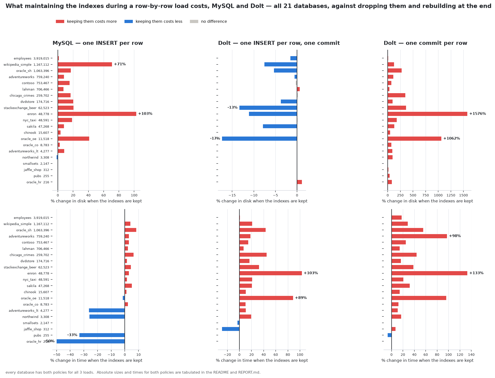
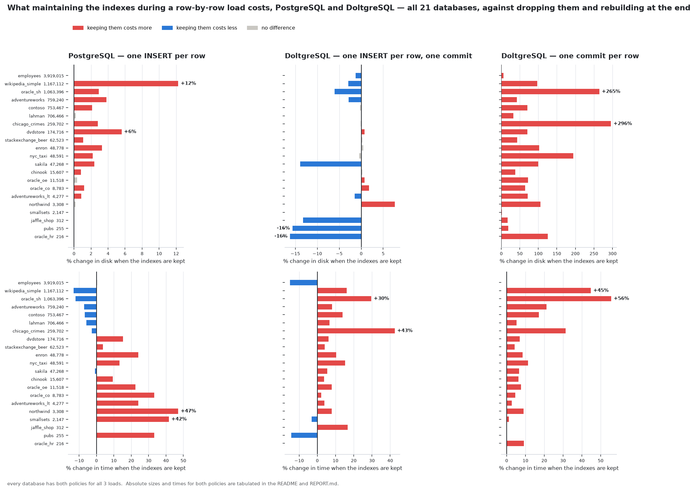
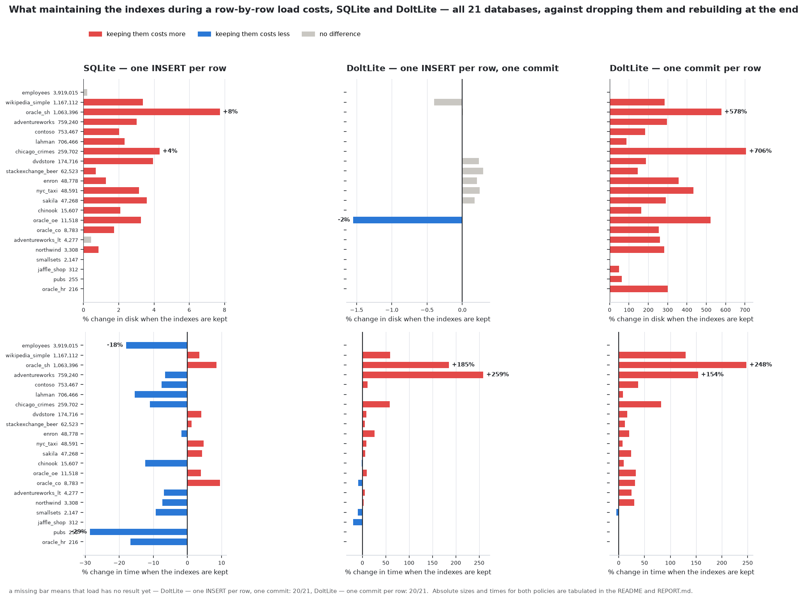
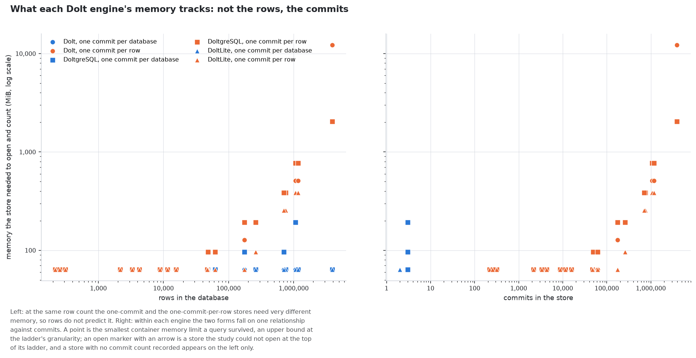

<!-- Generated by scripts/render.py from docs/templates/README.md and the files in
     build/. Do not edit this file: `make docs` overwrites it, and every number
     in it comes from a measurement rather than from anyone's memory. -->

# dolt-megasamples

**HUMAN NOTE**: This experiment was heavily AI driven and influenced and has only received "moderate" human oversight, and has not been peer reviewed.
PLEASE VERIFY THE FINDINGS YOU TAKE AWAY FROM THIS.

**An experiment: for the same data, what does a Dolt engine cost against the database it stands in
for -- [Dolt](https://github.com/dolthub/dolt) against MySQL,
[DoltgreSQL](https://github.com/dolthub/doltgresql) against PostgreSQL,
[DoltLite](https://github.com/dolthub/doltlite) against SQLite -- in disk, in time, and in memory?**

Each of the three is a SQL database with Git-like versioning that speaks the wire protocol of the
engine it stands in for, so the same clients work against both. Each stores data in an entirely
different way from its counterpart: InnoDB, PostgreSQL's heap and SQLite's B-tree write pages, while
the Dolt engines write content-addressed chunks into prolly trees and keep the history of every
change. Those are different enough that "how big will it be, and how long will it take?" is not
answerable by reasoning about it.

So this measures it, on the 21 sample databases from
[`sql-megasamples`](https://github.com/Reliable-Collaboration/sql-megasamples) -- 9,056,697
rows of real, varied, publicly-licensed data across 248 tables, from teaching schemas
of a few hundred rows to a star schema of several million -- from that corpus's own MySQL,
PostgreSQL and SQLite ports, each pair loaded from its own engine's dump.

**No number in this file was typed by a person.** This document is generated by
`scripts/render.py` from `docs/templates/README.md` and the measurement files in `build/`. A value
with no measurement behind it renders as `[not measured]` rather than as a blank or a stale figure,
and `make check` fails if what is on disk disagrees with the evidence.

| | |
|---|---|
| this experiment | <https://github.com/Reliable-Collaboration/dolt-megasamples> |
| the sample data it runs on | <https://github.com/Reliable-Collaboration/sql-megasamples> |

The two are separate on purpose. `sql-megasamples` builds the corpus -- 21 databases, their
provenance and their licences -- and is useful on its own to anyone who wants realistic sample data
in MySQL, PostgreSQL and SQLite. This repository only measures things, and reads that corpus as its
input.

## Versions

Every number in this document belongs to exactly one version of each engine, the versions below,
named in `versions.json`. Nothing is pinned and nothing moves on its own: `python3 scripts/versions.py
--check` says what is newer upstream, and `python3 scripts/versions.py --latest <engine>` moves one
engine to its newest release. A result set is measured on one version, so a moved version supersedes
every recorded unit of that engine and the runners measure them all again before its numbers return
to these tables (`knowledge/decisions/engine-versions-one-per-result-set.md`).

| engine | version of this result set | since | named by | what the image answers |
|---|---|---|---|---|
| MySQL | **9.7.2** | 2026-09-08 | `mysql:9.7.2` | /usr/sbin/mysqld  Ver 9.7.2 for Linux on x86_64 (MySQL Community Server - GPL) |
| Dolt | **2.3.2** | 2026-09-08 | `dolthub/dolt-sql-server@sha256:38d5e9005832…` | dolt version 2.3.2 |
| PostgreSQL | **18.6** | 2026-09-10 | `postgres@sha256:1c59e2c3c818…` | postgres (PostgreSQL) 18.6 (Debian 18.6-1.pgdg12+2) |
| DoltgreSQL | **1.3.2** | 2026-09-14 | `dolthub/doltgresql@sha256:267aff12f01c…` | release 1.3.2 |
| SQLite shell | **3.46.1** | 2026-09-10 | Debian 13's package in `debian:13-slim@sha256:d7e12182ce18…` | 3.46.1 2024-08-13 09:16:08 c9c2ab54ba1f5f46360f1b4f35d849cd3f080e6fc2b6c60e91b16c63f69aalt1 (64-bit) |
| DoltLite | **0.50.10** | 2026-09-12 | `libdoltlite0_0.50.10_amd64.deb` sha256 `09f2e13df763…`, `doltlite_0.50.10_amd64.deb` sha256 `3a832d5580cf…` | DoltLite v0.50.10 (SQLite 3.54.0, 64-bit) |

## The tests

Each pair's own dump is loaded five ways. Nothing differs but how the rows are written, and the
same five shapes are run for every pair, so a colour in the figures below means the same shape
wherever it appears.

| # | MySQL / Dolt | PostgreSQL / DoltgreSQL | SQLite / DoltLite | how the rows are written | why it is here |
|---|---|---|---|---|---|
| 1 | `mysql` | `postgres` | `sqlite` | the baseline in bulk: mysqldump's extended `INSERT`s, pg_dump's `COPY`, sqlite3's `.dump` inside its one transaction | the baseline anyone would actually use |
| 2 | `mysql_rowwise` | `postgres_rowwise` | `sqlite_rowwise` | one `INSERT` per row, each its own durable transaction | isolates what row-by-row writing costs **in the baseline**, so the Dolt engine's row-wise cost can be separated from the cost of row-wise writing at all |
| 3 | `dolt_oneshot` | `doltgres_oneshot` | `doltlite_oneshot` | the same file as test 1, one commit for the whole database | the Dolt engine's equivalent of test 1 |
| 4 | `dolt_rowinsert` | `doltgres_rowinsert` | `doltlite_rowinsert` | the same file as test 2, still one commit | isolates *statement* granularity from *commit* granularity |
| 5 | `dolt_rowcommit` | `doltgres_rowcommit` | `doltlite_rowcommit` | one `INSERT` per row, and one commit **after every row** | isolates what history costs -- the thing a Dolt engine exists to keep |

Tests 2 and 5 are the closest each engine has to the other's worst case: the baselines commit every
autocommitted statement, so one `INSERT` per row is one durable transaction per row.

**Tests 2, 4 and 5 each run under two index policies**, because a row-by-row load that also
maintains an index measures two things at once.

| policy | what happens during the load | flag |
|---|---|---|
| **deferred** (default) | secondary indexes and constraints come after the last row: on the MySQL side they come out of `CREATE TABLE`, the rows load with `UNIQUE_CHECKS` and `FOREIGN_KEY_CHECKS` off, and `ALTER TABLE ... ADD` rebuilds them -- for Dolt, inside the final commit; on the PostgreSQL and SQLite sides the dumps already write indexes and constraints after the rows | `--indexes deferred` |
| **inline** | every index and constraint is maintained on every row: on the PostgreSQL and SQLite sides every `CREATE INDEX` (and, for pg_dump, every `UNIQUE` constraint) moves ahead of the first row | `--indexes inline` |

This is the standard way to bulk-load any of these engines, and separating it out is what lets the
cost of *writing rows one at a time* be told apart from the cost of *maintaining an index while
doing it*.

Two keys are never deferred. The **primary key** is the row's identity -- a Dolt engine stores tables
as a prolly tree keyed by it, and a table loaded without one is a different table. And, on the MySQL
side, a key that an **`AUTO_INCREMENT` column depends on** stays inline wherever that column does not
lead the primary key, because MySQL requires such a column to lead some key and refuses the table
otherwise. Each load's notes name every key held back for that reason. Foreign keys are never in
force during a load on the PostgreSQL side (the data is written in table-creation order) and are
declared but unenforced on the SQLite side (`PRAGMA foreign_keys=OFF`, the dump's first line), the
counterpart of mysqldump's `FOREIGN_KEY_CHECKS=0`. Both policies end with the same schema, and index
parity against the baseline is checked under each.

Tests 1 and 3 have no policy: a bulk load builds an index over batches whichever way you ask, and on
the MySQL side both policies produced byte-identical files.

### How each load is performed

MySQL and Dolt:


* **MySQL** is loaded into a **fresh, empty server** — not read from the megasamples image, which was
  built by a `mysqlsh` restore with deferred index builds and is measurably more compact than the
  same data loaded from SQL. Comparing against it would compare Dolt against a differently-built
  MySQL.
* **Dolt** is loaded by the `dolt` CLI. **Each database gets its own data directory**, which is not
  a detail: Dolt opens every database under its `--data-dir` at startup, so a shared directory made
  each load pay to open everything loaded before it. That inflated the later loads in every phase
  and, at the size the per-row-commit directory reaches, exhausted the host outright.
* **Both engines load the identical transformed file.** `scripts/dolt_dialect.py` documents each
  rule and each is reported; none of them touches a row.
* **Sizes exclude what a server writes.** A `dolt sql-server` writes statistics into `.dolt/stats`
  that `dolt gc` does not reclaim, so a served directory and an unserved one are not comparable by
  `du`. The measurement subtracts them and reports separately what a server adds.

PostgreSQL and DoltgreSQL, SQLite and DoltLite:

* **Every DoltgreSQL load runs in a server started for it alone**, over an empty root, so what a load
  costs is that database's alone; the first version kept one server per shape, and a 255-row database
  then peaked at nearly a gigabyte because of everything loaded before it. PostgreSQL likewise gets a
  fresh server per load.
* **"The same file" for DoltLite is the dump replayed into a DoltLite-format database.** A stock
  SQLite file opened by DoltLite runs on SQLite's own B-tree engine without version control, which
  would have measured SQLite twice. The `sqlite` baseline is the same replay by `sqlite3`.
* **Both engines of a pair load the same transformed file.** `scripts/doltgres_dialect.py` and
  `scripts/doltlite_dialect.py` hold the rules, each found by refusal and named in every unit's
  notes: a GIN index DoltgreSQL cannot build, `regexp_like` checks and generated-column tables it
  cannot take rows for, the order and the virtual-table registration DoltLite needs. What an engine
  still refuses -- a view over `xpath`, a view over `JSON_TABLE` -- is recorded on the unit and
  listed under *Does each pair hold the same thing?*, never hidden.
* **A fresh PostgreSQL database is not empty**: it is a copy of the template catalog, about 7 MiB
  before the first row, which MySQL's per-schema directory and Dolt's repository do not carry. The
  PostgreSQL sizes include it; the ratio for a small database is therefore mostly that floor.

### How each load is measured

* **Disk** — `du -sb` of the directory the engine keeps the database in, after the load has settled:
  for Dolt, after the commit and `dolt gc`, because Dolt writes through a journal and measuring
  before packing reports the write-ahead state rather than the stored one. A `du` that fails raises
  rather than returning zero.
* **Time** — wall clock around the load itself, excluding the dump, the transform, and the
  measurement. Both engines are timed the same way, by `docker exec` into a container that is
  already up, so neither's timings contain container startup. That start costs a measured
  0.32 s, and used to be paid twice per Dolt load and not at all by MySQL.
* **Repeats, where a repeat is affordable.** Each unit runs up to three times and the median of every
  sample is kept, until it has spent its repeat budget; after that it is a single sample. Of the
  units recorded so far, 50 of 168 were measured once. Across
  the repeated ones the spread is 0.0% median and
  31.5% worst for size, and 2.7% median and
  50.0% worst for time. The pairs' units are single samples, each
  measured once with the same method.
* **Every load ends settled before it is sized**, and the settle step is timed separately from the
  load: Dolt commits and runs `dolt gc`; DoltgreSQL runs `dolt_commit` and `dolt_gc()`; DoltLite runs
  `dolt_commit` and `VACUUM`; PostgreSQL runs `CHECKPOINT`; SQLite and MySQL need nothing. A settle
  step that fails is kept and marked -- the store is reported at the working footprint of the load, not
  hidden and not loaded again to meet the same limit.
* **Correctness, before any size is recorded** — every table counted with `COUNT(*)` on both sides,
  and every index compared by definition. A load short in any table is recorded as a failure, not as
  a small number.

* **Memory, on the pairs** -- peak memory the kernel cannot reclaim, anonymous plus shared since
  swap is off, of the container each load runs in, read four times a second from before the load
  until after its settle step, so a collection that runs out of memory shows in it. Every unit also
  records its container's own peak, page cache included, and the memory cap it ran under.

## The results

One table per pair, the same five loads across, every database down. The figures after them draw
all three pairs on the same axes and in the same colours, each pair against its own baseline.

### MySQL and Dolt

| database | rows | 1. MySQL | 2. MySQL<br>row-wise | 3. Dolt<br>1 commit/db | 4. Dolt<br>1 INSERT/row | 5. Dolt<br>1 commit/row |
|---|---:|---:|---:|---:|---:|---:|
| `employees` | 3,919,015 | 178.3 MiB<br>11s | 176.3 MiB<br>**0.99×**<br>1,850s | 42.5 MiB<br>**0.24×**<br>29s | 39.9 MiB<br>**0.22×**<br>1.4h | 63.3 GiB<br>**363×**<br>3.5h |
| `wikipedia_simple` | 1,167,112 | 314.2 MiB<br>15s | 235.2 MiB<br>**0.75×**<br>582s | 122.4 MiB<br>**0.39×**<br>92s | 123.2 MiB<br>**0.39×**<br>1,568s | 12.6 GiB<br>**41×**<br>1.0h |
| `oracle_sh` | 1,063,396 | 220.2 MiB<br>8s | 188.4 MiB<br>**0.86×**<br>510s | 143.3 MiB<br>**0.65×**<br>39s | 143.2 MiB<br>**0.65×**<br>1,475s | 14.9 GiB<br>**69×**<br>3,517s |
| `adventureworks` | 759,240 | 335.9 MiB<br>8s | 311.0 MiB<br>**0.93×**<br>394s | 49.2 MiB<br>**0.15×**<br>16s | 49.2 MiB<br>**0.15×**<br>1,269s | 7.2 GiB<br>**22×**<br>3,454s |
| `contoso` | 753,467 | 156.3 MiB<br>5s | 135.3 MiB<br>**0.87×**<br>369s | 39.3 MiB<br>**0.25×**<br>14s | 39.4 MiB<br>**0.25×**<br>926s | 6.6 GiB<br>**43×**<br>2,181s |
| `lahman` | 706,466 | 191.8 MiB<br>6s | 178.9 MiB<br>**0.93×**<br>347s | 26.3 MiB<br>**0.14×**<br>18s | 26.3 MiB<br>**0.14×**<br>953s | 6.5 GiB<br>**35×**<br>2,257s |
| `chicago_crimes` | 259,702 | 84.1 MiB<br>4s | 72.1 MiB<br>**0.86×**<br>134s | 28.7 MiB<br>**0.34×**<br>11s | 28.7 MiB<br>**0.34×**<br>359s | 2.3 GiB<br>**28×**<br>768s |
| `dvdstore` | 174,716 | 60.0 MiB<br>1s | 50.0 MiB<br>**0.83×**<br>84s | 11.9 MiB<br>**0.20×**<br>3s | 12.4 MiB<br>**0.21×**<br>216s | 1.7 GiB<br>**29×**<br>493s |
| `stackexchange_beer` | 62,523 | 83.6 MiB<br>1s | 73.6 MiB<br>**0.88×**<br>33s | 14.0 MiB<br>**0.17×**<br>8s | 16.1 MiB<br>**0.19×**<br>90s | 435.8 MiB<br>**5.21×**<br>188s |
| `enron` | 48,778 | 98.2 MiB<br>2s | 66.2 MiB<br>**0.67×**<br>30s | 34.1 MiB<br>**0.35×**<br>30s | 38.6 MiB<br>**0.39×**<br>90s | 357.9 MiB<br>**3.64×**<br>161s |
| `nyc_taxi` | 48,591 | 19.1 MiB<br>1s | 16.1 MiB<br>**0.84×**<br>25s | 3.0 MiB<br>**0.16×**<br>2s | 3.0 MiB<br>**0.16×**<br>65s | 331.6 MiB<br>**17×**<br>134s |
| `sakila` | 47,268 | 24.1 MiB<br>1s | 22.3 MiB<br>**0.92×**<br>23s | 2.0 MiB<br>**0.08×**<br>1s | 2.2 MiB<br>**0.09×**<br>68s | 300.3 MiB<br>**12×**<br>156s |
| `chinook` | 15,607 | 2.7 MiB<br>0s | 2.6 MiB<br>**0.97×**<br>8s | 615.0 KiB<br>**0.22×**<br>0s | 615.0 KiB<br>**0.22×**<br>19s | 77.5 MiB<br>**29×**<br>45s |
| `oracle_oe` | 11,518 | 27.5 MiB<br>1s | 19.6 MiB<br>**0.71×**<br>7s | 4.3 MiB<br>**0.16×**<br>3s | 5.1 MiB<br>**0.18×**<br>18s | 70.2 MiB<br>**2.55×**<br>36s |
| `oracle_co` | 8,783 | 1.8 MiB<br>0s | 1.8 MiB<br>**0.97×**<br>5s | 456.3 KiB<br>**0.24×**<br>0s | 456.1 KiB<br>**0.24×**<br>11s | 39.1 MiB<br>**21×**<br>24s |
| `adventureworks_lt` | 4,277 | 12.5 MiB<br>0s | 11.5 MiB<br>**0.92×**<br>4s | 1.0 MiB<br>**0.08×**<br>0s | 1.0 MiB<br>**0.08×**<br>6s | 20.1 MiB<br>**1.61×**<br>13s |
| `northwind` | 3,308 | 2.6 MiB<br>0s | 2.7 MiB<br>**1.02×**<br>3s | 518.5 KiB<br>**0.19×**<br>0s | 518.5 KiB<br>**0.19×**<br>5s | 13.9 MiB<br>**5.27×**<br>11s |
| `smallsets` | 2,147 | 644.0 KiB<br>0s | 644.0 KiB<br>**1.00×**<br>1s | 164.3 KiB<br>**0.26×**<br>0s | 164.3 KiB<br>**0.26×**<br>3s | 8.4 MiB<br>**13×**<br>6s |
| `jaffle_shop` | 312 | 372.0 KiB<br>0s | 372.0 KiB<br>**1.00×**<br>0s | 37.7 KiB<br>**0.10×**<br>0s | 37.7 KiB<br>**0.10×**<br>1s | 658.2 KiB<br>**1.77×**<br>1s |
| `pubs` | 255 | 1.5 MiB<br>0s | 1.5 MiB<br>**1.00×**<br>1s | 77.0 KiB<br>**0.05×**<br>0s | 77.0 KiB<br>**0.05×**<br>1s | 578.5 KiB<br>**0.39×**<br>2s |
| `oracle_hr` | 216 | 1.1 MiB<br>0s | 1.1 MiB<br>**1.00×**<br>1s | 62.8 KiB<br>**0.06×**<br>0s | 62.1 KiB<br>**0.06×**<br>1s | 456.0 KiB<br>**0.41×**<br>1s |
| **all 21 with every test** | **9,056,697** | **1.8 GiB<br>67s** | **0.86×<br>66× time** | **0.29×<br>4.0× time** | **0.29×<br>182× time** | **66×<br>447× time** |

### PostgreSQL and DoltgreSQL

| database | rows | 1. PostgreSQL<br>COPY | 2. PostgreSQL<br>1 INSERT/row | 3. DoltgreSQL<br>1 commit/db | 4. DoltgreSQL<br>1 INSERT/row | 5. DoltgreSQL<br>1 commit/row |
|---|---:|---:|---:|---:|---:|---:|
| `employees` | 3,919,015 | 282.9 MiB<br>4s | 283.2 MiB<br>**1.00×**<br>1,608s | 60.7 MiB<br>**0.21×**<br>29s | 51.8 MiB<br>**0.18×**<br>2.2h | 36.6 GiB<br>**132×**<br>6.0h |
| `wikipedia_simple` | 1,167,112 | 204.6 MiB<br>2s | 203.7 MiB<br>**1.00×**<br>571s | 54.8 MiB<br>**0.27×**<br>13s | 54.8 MiB<br>**0.27×**<br>1,814s | 10.1 GiB<br>**51×**<br>1.5h |
| `oracle_sh` | 1,063,396 | 116.6 MiB<br>2s | 115.8 MiB<br>**0.99×**<br>519s | 144.7 MiB<br>**1.24×**<br>59s | 145.0 MiB<br>**1.24×**<br>1,808s | 15.5 GiB<br>**136×**<br>1.3h |
| `adventureworks` | 759,240 | 144.1 MiB<br>2s | 141.0 MiB<br>**0.98×**<br>338s | 38.7 MiB<br>**0.27×**<br>12s | 38.6 MiB<br>**0.27×**<br>2,412s | 8.1 GiB<br>**57×**<br>2.3h |
| `contoso` | 753,467 | 116.1 MiB<br>1s | 115.1 MiB<br>**0.99×**<br>327s | 40.3 MiB<br>**0.35×**<br>10s | 40.4 MiB<br>**0.35×**<br>1,024s | 6.8 GiB<br>**60×**<br>3,001s |
| `lahman` | 706,466 | 97.1 MiB<br>1s | 93.9 MiB<br>**0.97×**<br>308s | 27.2 MiB<br>**0.28×**<br>8s | 27.2 MiB<br>**0.28×**<br>1,115s | 6.9 GiB<br>**73×**<br>3,350s |
| `chicago_crimes` | 260,041 | 74.2 MiB<br>1s | 74.3 MiB<br>**1.00×**<br>116s | 29.8 MiB<br>**0.40×**<br>6s | 29.8 MiB<br>**0.40×**<br>358s | 2.4 GiB<br>**33×**<br>997s |
| `dvdstore` | 174,716 | 26.5 MiB<br>0s | 25.2 MiB<br>**0.95×**<br>82s | 10.8 MiB<br>**0.41×**<br>3s | 10.8 MiB<br>**0.41×**<br>270s | 1.7 GiB<br>**68×**<br>794s |
| `stackexchange_beer` | 62,523 | 26.1 MiB<br>0s | 25.3 MiB<br>**0.97×**<br>32s | 7.6 MiB<br>**0.29×**<br>1s | 7.6 MiB<br>**0.29×**<br>92s | 462.3 MiB<br>**18×**<br>259s |
| `enron` | 48,778 | 30.3 MiB<br>0s | 29.9 MiB<br>**0.99×**<br>23s | 9.2 MiB<br>**0.30×**<br>2s | 9.1 MiB<br>**0.30×**<br>69s | 352.0 MiB<br>**12×**<br>187s |
| `nyc_taxi` | 48,591 | 17.1 MiB<br>0s | 17.0 MiB<br>**0.99×**<br>26s | 2.8 MiB<br>**0.16×**<br>1s | 2.8 MiB<br>**0.16×**<br>76s | 312.8 MiB<br>**18×**<br>197s |
| `sakila` | 47,268 | 16.0 MiB<br>0s | 15.3 MiB<br>**0.95×**<br>24s | 1.9 MiB<br>**0.12×**<br>1s | 1.9 MiB<br>**0.12×**<br>100s | 323.0 MiB<br>**20×**<br>325s |
| `chinook` | 15,607 | 9.9 MiB<br>0s | 9.8 MiB<br>**0.99×**<br>8s | 615.3 KiB<br>**0.06×**<br>0s | 599.8 KiB<br>**0.06×**<br>22s | 85.9 MiB<br>**8.71×**<br>60s |
| `oracle_oe` | 11,518 | 11.3 MiB<br>0s | 10.9 MiB<br>**0.96×**<br>6s | 1.5 MiB<br>**0.14×**<br>0s | 1.5 MiB<br>**0.13×**<br>18s | 81.2 MiB<br>**7.19×**<br>48s |
| `oracle_co` | 8,783 | 9.3 MiB<br>0s | 9.3 MiB<br>**1.00×**<br>4s | 454.5 KiB<br>**0.05×**<br>0s | 441.0 KiB<br>**0.05×**<br>14s | 42.9 MiB<br>**4.62×**<br>37s |
| `adventureworks_lt` | 4,277 | 11.2 MiB<br>0s | 11.1 MiB<br>**0.99×**<br>2s | 1,007.6 KiB<br>**0.09×**<br>0s | 1,011.8 KiB<br>**0.09×**<br>8s | 20.9 MiB<br>**1.86×**<br>22s |
| `northwind` | 3,308 | 9.4 MiB<br>0s | 9.4 MiB<br>**1.00×**<br>2s | 539.3 KiB<br>**0.06×**<br>0s | 516.0 KiB<br>**0.05×**<br>6s | 13.9 MiB<br>**1.48×**<br>17s |
| `smallsets` | 2,147 | 8.0 MiB<br>0s | 8.0 MiB<br>**1.00×**<br>1s | 156.3 KiB<br>**0.02×**<br>0s | 156.3 KiB<br>**0.02×**<br>3s | 8.4 MiB<br>**1.05×**<br>8s |
| `jaffle_shop` | 312 | 7.6 MiB<br>0s | 7.6 MiB<br>**1.00×**<br>0s | 16.8 KiB<br>**0.00×**<br>0s | 21.2 KiB<br>**0.00×**<br>1s | 671.7 KiB<br>**0.09×**<br>1s |
| `pubs` | 255 | 8.1 MiB<br>0s | 8.1 MiB<br>**1.00×**<br>0s | 65.1 KiB<br>**0.01×**<br>0s | 81.4 KiB<br>**0.01×**<br>1s | 652.4 KiB<br>**0.08×**<br>2s |
| `oracle_hr` | 216 | 8.1 MiB<br>0s | 8.1 MiB<br>**1.00×**<br>0s | 43.1 KiB<br>**0.01×**<br>0s | 54.5 KiB<br>**0.01×**<br>1s | 392.8 KiB<br>**0.05×**<br>1s |
| **all 21 with every test** | **9,057,036** | **1.2 GiB<br>16s** | **0.99×<br>244× time** | **0.35×<br>9× time** | **0.34×<br>1052× time** | **74.52×<br>3008× time** |

### SQLite and DoltLite

| database | rows | 1. SQLite<br>one transaction | 2. SQLite<br>1 INSERT/row | 3. DoltLite<br>1 commit/db | 4. DoltLite<br>1 INSERT/row | 5. DoltLite<br>1 commit/row |
|---|---:|---:|---:|---:|---:|---:|
| `employees` | 3,919,015 | 244.6 MiB<br>8s | 244.6 MiB<br>**1.00×**<br>2.1h | 248.6 MiB<br>**1.02×**<br>10s | 248.6 MiB<br>**1.02×**<br>1.3h | 317.8 GiB †<br>2.6h |
| `wikipedia_simple` | 1,167,112 | 137.4 MiB<br>3s | 137.4 MiB<br>**1.00×**<br>1,746s | 183.7 MiB<br>**1.34×**<br>5s | 183.7 MiB<br>**1.34×**<br>1,063s | 7.7 GiB<br>**57×**<br>2,535s |
| `oracle_sh` | 1,063,396 | 109.1 MiB<br>2s | 109.1 MiB<br>**1.00×**<br>1,556s | 193.5 MiB<br>**1.77×**<br>7s | 193.5 MiB<br>**1.77×**<br>997s | 7.6 GiB<br>**71×**<br>2,419s |
| `adventureworks` | 759,240 | 122.4 MiB<br>3s | 122.4 MiB<br>**1.00×**<br>1,326s | 175.7 MiB<br>**1.44×**<br>4s | 175.7 MiB<br>**1.44×**<br>719s | 8.8 GiB<br>**73×**<br>1.0h |
| `contoso` | 753,467 | 82.0 MiB<br>2s | 82.0 MiB<br>**1.00×**<br>1,309s | 105.7 MiB<br>**1.29×**<br>3s | 105.7 MiB<br>**1.29×**<br>692s | 4.5 GiB<br>**56×**<br>1,514s |
| `lahman` | 706,466 | 63.6 MiB<br>2s | 63.6 MiB<br>**1.00×**<br>1,327s | 83.8 MiB<br>**1.32×**<br>3s | 83.8 MiB<br>**1.32×**<br>656s | 5.0 GiB<br>**81×**<br>1,976s |
| `chicago_crimes` | 260,041 | 67.2 MiB<br>1s | 67.2 MiB<br>**1.00×**<br>491s | 88.7 MiB<br>**1.32×**<br>2s | 88.7 MiB<br>**1.32×**<br>231s | 1.8 GiB<br>**27×**<br>484s |
| `dvdstore` | 174,716 | 9.9 MiB<br>0s | 9.9 MiB<br>**1.00×**<br>296s | 17.2 MiB<br>**1.74×**<br>1s | 17.2 MiB<br>**1.74×**<br>154s | 1,020.7 MiB<br>**103×**<br>375s |
| `stackexchange_beer` | 62,523 | 19.0 MiB<br>0s | 19.0 MiB<br>**1.00×**<br>111s | 19.2 MiB<br>**1.01×**<br>0s | 19.2 MiB<br>**1.01×**<br>55s | 336.2 MiB<br>**18×**<br>134s |
| `enron` | 48,778 | 38.4 MiB<br>1s | 38.4 MiB<br>**1.00×**<br>92s | 38.2 MiB<br>**0.99×**<br>1s | 38.2 MiB<br>**0.99×**<br>46s | 295.1 MiB<br>**7.67×**<br>101s |
| `nyc_taxi` | 48,591 | 8.4 MiB<br>0s | 8.4 MiB<br>**1.00×**<br>85s | 11.1 MiB<br>**1.31×**<br>0s | 11.1 MiB<br>**1.31×**<br>44s | 233.2 MiB<br>**28×**<br>95s |
| `sakila` | 47,268 | 5.0 MiB<br>0s | 5.0 MiB<br>**1.00×**<br>82s | 8.1 MiB<br>**1.62×**<br>0s | 8.1 MiB<br>**1.62×**<br>42s | 279.6 MiB<br>**56×**<br>113s |
| `chinook` | 15,607 | 960.0 KiB<br>0s | 960.0 KiB<br>**1.00×**<br>31s | 1.2 MiB<br>**1.29×**<br>0s | 1.2 MiB<br>**1.29×**<br>14s | 67.2 MiB<br>**72×**<br>33s |
| `oracle_oe` | 11,518 | 3.4 MiB<br>0s | 3.4 MiB<br>**1.00×**<br>20s | 4.8 MiB<br>**1.43×**<br>0s | 4.8 MiB<br>**1.43×**<br>11s | 62.5 MiB<br>**19×**<br>24s |
| `oracle_co` | 8,783 | 692.0 KiB<br>0s | 692.0 KiB<br>**1.00×**<br>15s | 1.0 MiB<br>**1.55×**<br>0s | 1.0 MiB<br>**1.55×**<br>9s | 30.0 MiB<br>**44×**<br>16s |
| `adventureworks_lt` | 4,277 | 2.7 MiB<br>0s | 2.7 MiB<br>**1.00×**<br>9s | 2.6 MiB<br>**0.94×**<br>0s | 2.6 MiB<br>**0.94×**<br>4s | 19.0 MiB<br>**6.96×**<br>10s |
| `northwind` | 3,308 | 940.0 KiB<br>0s | 940.0 KiB<br>**1.00×**<br>7s | 856.6 KiB<br>**0.91×**<br>0s | 856.6 KiB<br>**0.91×**<br>3s | 13.6 MiB<br>**15×**<br>7s |
| `smallsets` | 2,147 | 212.0 KiB<br>0s | 212.0 KiB<br>**1.00×**<br>4s | 214.7 KiB<br>**1.01×**<br>0s | 214.7 KiB<br>**1.01×**<br>2s | 6.5 MiB<br>**31×**<br>4s |
| `jaffle_shop` | 312 | 24.0 KiB<br>0s | 24.0 KiB<br>**1.00×**<br>1s | 18.6 KiB<br>**0.77×**<br>0s | 18.6 KiB<br>**0.77×**<br>0s | 719.8 KiB<br>**30×**<br>1s |
| `pubs` | 255 | 224.0 KiB<br>0s | 224.0 KiB<br>**1.00×**<br>1s | 126.8 KiB<br>**0.57×**<br>0s | 126.8 KiB<br>**0.57×**<br>0s | 739.9 KiB<br>**3.30×**<br>1s |
| `oracle_hr` | 216 | 152.0 KiB<br>0s | 152.0 KiB<br>**1.00×**<br>1s | 53.2 KiB<br>**0.35×**<br>0s | 53.2 KiB<br>**0.35×**<br>0s | 461.7 KiB<br>**3.04×**<br>1s |
| **all 20 with every test** | **5,138,021** | **671.7 MiB<br>17s** | **1.00×<br>489× time** | **1.39×<br>2× time** | **1.39×<br>273× time** | **57.43×<br>780× time** |

*Each cell is disk then time; a versioned cell also gives the size as a multiple of test 1. 1 database(s) do not yet have every test and are excluded from the totals row: `employees`.*

*† The store could not be garbage-collected, so this is the working footprint after the load, not a collected size, and it is left out of the totals row: `employees` (5. DoltLite, 1 commit/row).*

### The figures


## What maintaining the indexes costs

The three row-by-row loads of every pair, run again with every secondary index and constraint kept
for the whole load, as a change from dropping them and rebuilding at the end. The question is a
polarity -- more or less -- so each figure is a diverging bar against a zero line; the tables carry
both policies' absolute sizes and times.







### MySQL and Dolt

Tests 2, 4 and 5 run twice: once with the secondary indexes and foreign keys dropped for the load and rebuilt afterwards, and once with every index maintained on every row. Everything else is identical, including the final schema. A positive number means keeping the indexes cost more.

#### MySQL, one `INSERT` per row

| database | disk, deferred | disk, inline | change | time, deferred | time, inline | change |
|---|---:|---:|---:|---:|---:|---:|
| `employees` | 176.3 MiB | 178.3 MiB | +1.1% | 1,850s | 1,846s | -0.2% |
| `wikipedia_simple` | 235.2 MiB | 402.2 MiB | +71.0% | 582s | 606s | +4.1% |
| `oracle_sh` | 188.4 MiB | 220.2 MiB | +16.9% | 510s | 552s | +8.3% |
| `adventureworks` | 311.0 MiB | 335.9 MiB | +8.0% | 394s | 406s | +3.0% |
| `contoso` | 135.3 MiB | 156.3 MiB | +15.5% | 369s | 380s | +3.0% |
| `lahman` | 178.9 MiB | 191.8 MiB | +7.3% | 347s | 355s | +2.3% |
| `chicago_crimes` | 72.1 MiB | 84.1 MiB | +16.6% | 134s | 143s | +6.3% |
| `dvdstore` | 50.0 MiB | 60.1 MiB | +20.2% | 84s | 85s | +1.5% |
| `stackexchange_beer` | 73.6 MiB | 88.6 MiB | +20.4% | 33s | 35s | +4.5% |
| `enron` | 66.2 MiB | 134.2 MiB | +102.7% | 30s | 31s | +3.0% |
| `nyc_taxi` | 16.1 MiB | 19.1 MiB | +18.6% | 25s | 26s | +1.6% |
| `sakila` | 22.3 MiB | 24.1 MiB | +8.1% | 23s | 24s | +5.2% |
| `chinook` | 2.6 MiB | 2.7 MiB | +3.6% | 8s | 8s | +1.3% |
| `oracle_oe` | 19.6 MiB | 27.6 MiB | +41.1% | 7s | 7s | -1.4% |
| `oracle_co` | 1.8 MiB | 1.8 MiB | +2.6% | 5s | 5s | +2.2% |
| `adventureworks_lt` | 11.5 MiB | 12.5 MiB | +8.4% | 4s | 3s | -26.3% |
| `northwind` | 2.7 MiB | 2.6 MiB | -1.8% | 3s | 2s | -25.9% |
| `smallsets` | 644.0 KiB | 644.0 KiB | +0.0% | 1s | 1s | +0.0% |
| `jaffle_shop` | 372.0 KiB | 372.0 KiB | +0.0% | 0s | 0s | +0.0% |
| `pubs` | 1.5 MiB | 1.5 MiB | +0.0% | 1s | 0s | -33.3% |
| `oracle_hr` | 1.1 MiB | 1.1 MiB | +0.0% | 1s | 0s | -50.0% |
| **21 databases** | **1.5 GiB** | **1.9 GiB** | **+24.2%** | **1.2h** | **1.3h** | **+2.4%** |

#### Dolt, one `INSERT` per row, one commit

| database | disk, deferred | disk, inline | change | time, deferred | time, inline | change |
|---|---:|---:|---:|---:|---:|---:|
| `employees` | 39.9 MiB | 39.3 MiB | -1.5% | 1.4h | 1.4h | +1.0% |
| `wikipedia_simple` | 123.2 MiB | 113.9 MiB | -7.5% | 1,568s | 1,898s | +21.0% |
| `oracle_sh` | 143.2 MiB | 135.5 MiB | -5.3% | 1,475s | 2,111s | +43.1% |
| `adventureworks` | 49.2 MiB | 48.9 MiB | -0.6% | 1,269s | 1,502s | +18.3% |
| `contoso` | 39.4 MiB | 39.3 MiB | -0.3% | 926s | 1,061s | +14.6% |
| `lahman` | 26.3 MiB | 26.4 MiB | +0.6% | 953s | 1,019s | +7.0% |
| `chicago_crimes` | 28.7 MiB | 28.8 MiB | +0.2% | 359s | 520s | +44.7% |
| `dvdstore` | 12.4 MiB | 11.9 MiB | -3.8% | 216s | 251s | +16.7% |
| `stackexchange_beer` | 16.1 MiB | 14.0 MiB | -13.3% | 90s | 119s | +32.4% |
| `enron` | 38.6 MiB | 34.3 MiB | -11.1% | 90s | 183s | +103.0% |
| `nyc_taxi` | 3.0 MiB | 3.0 MiB | +0.1% | 65s | 79s | +21.0% |
| `sakila` | 2.2 MiB | 2.0 MiB | -7.9% | 68s | 82s | +20.5% |
| `chinook` | 615.0 KiB | 615.0 KiB | +0.0% | 19s | 21s | +10.5% |
| `oracle_oe` | 5.1 MiB | 4.2 MiB | -17.3% | 18s | 33s | +88.6% |
| `oracle_co` | 456.1 KiB | 456.3 KiB | +0.0% | 11s | 12s | +10.1% |
| `adventureworks_lt` | 1.0 MiB | 1.0 MiB | -0.0% | 6s | 6s | +10.3% |
| `northwind` | 518.5 KiB | 518.5 KiB | +0.0% | 5s | 6s | +19.6% |
| `smallsets` | 164.3 KiB | 164.3 KiB | +0.0% | 3s | 3s | -3.3% |
| `jaffle_shop` | 37.7 KiB | 37.7 KiB | +0.0% | 1s | 0s | -28.6% |
| `pubs` | 77.0 KiB | 77.0 KiB | -0.0% | 1s | 1s | +0.0% |
| `oracle_hr` | 62.1 KiB | 62.8 KiB | +1.1% | 1s | 1s | +0.0% |
| **21 databases** | **530.0 MiB** | **504.4 MiB** | **-4.8%** | **3.4h** | **3.9h** | **+14.9%** |

#### Dolt, one commit per row

| database | disk, deferred | disk, inline | change | time, deferred | time, inline | change |
|---|---:|---:|---:|---:|---:|---:|
| `employees` | 63.3 GiB | 67.7 GiB | +7.1% | 3.5h | 4.2h | +17.8% |
| `wikipedia_simple` | 12.6 GiB | 28.2 GiB | +123.9% | 1.0h | 1.3h | +28.5% |
| `oracle_sh` | 14.9 GiB | 56.0 GiB | +276.4% | 3,517s | 1.5h | +55.5% |
| `adventureworks` | 7.2 GiB | 15.0 GiB | +109.5% | 3,454s | 1.9h | +97.5% |
| `contoso` | 6.6 GiB | 11.1 GiB | +69.6% | 2,181s | 2,726s | +25.0% |
| `lahman` | 6.5 GiB | 8.7 GiB | +34.0% | 2,257s | 2,579s | +14.3% |
| `chicago_crimes` | 2.3 GiB | 10.4 GiB | +349.6% | 768s | 1,105s | +43.9% |
| `dvdstore` | 1.7 GiB | 3.3 GiB | +93.6% | 493s | 575s | +16.6% |
| `stackexchange_beer` | 435.8 MiB | 2.0 GiB | +361.5% | 188s | 260s | +38.5% |
| `enron` | 357.9 MiB | 5.9 GiB | +1576.3% | 161s | 376s | +133.1% |
| `nyc_taxi` | 331.6 MiB | 923.2 MiB | +178.4% | 134s | 162s | +20.8% |
| `sakila` | 300.3 MiB | 690.4 MiB | +129.9% | 156s | 206s | +31.9% |
| `chinook` | 77.5 MiB | 114.3 MiB | +47.5% | 45s | 51s | +14.6% |
| `oracle_oe` | 70.2 MiB | 816.5 MiB | +1062.4% | 36s | 70s | +96.1% |
| `oracle_co` | 39.1 MiB | 66.6 MiB | +70.2% | 24s | 27s | +12.3% |
| `adventureworks_lt` | 20.1 MiB | 38.0 MiB | +89.0% | 13s | 14s | +10.8% |
| `northwind` | 13.9 MiB | 26.9 MiB | +93.9% | 11s | 12s | +17.0% |
| `smallsets` | 8.4 MiB | 8.3 MiB | -0.6% | 6s | 6s | +0.0% |
| `jaffle_shop` | 658.2 KiB | 735.4 KiB | +11.7% | 1s | 2s | +7.1% |
| `pubs` | 578.5 KiB | 794.4 KiB | +37.3% | 2s | 1s | -6.7% |
| `oracle_hr` | 456.0 KiB | 823.1 KiB | +80.5% | 1s | 1s | +0.0% |
| **21 databases** | **116.7 GiB** | **211.0 GiB** | **+80.9%** | **8.3h** | **11.2h** | **+34.6%** |


### PostgreSQL and DoltgreSQL

| database | 2. PostgreSQL<br>1 INSERT/row<br>deferred → inline | 4. DoltgreSQL<br>1 INSERT/row<br>deferred → inline | 5. DoltgreSQL<br>1 commit/row<br>deferred → inline |
|---|---:|---:|---:|
| `employees` | 283.2 MiB → 283.1 MiB<br>1,608s → 1,614s | 51.8 MiB → 51.2 MiB<br>2.2h → 1.9h | 36.6 GiB → 38.8 GiB<br>6.0h → 6.0h |
| `wikipedia_simple` | 203.7 MiB → 228.6 MiB<br>571s → 496s | 54.8 MiB → 53.1 MiB<br>1,814s → 2,106s | 10.1 GiB → 19.9 GiB<br>1.5h → 2.2h |
| `oracle_sh` | 115.8 MiB → 119.1 MiB<br>519s → 456s | 145.0 MiB → 136.3 MiB<br>1,808s → 2,344s | 15.5 GiB → 56.6 GiB<br>1.3h → 2.1h |
| `adventureworks` | 141.0 MiB → 146.4 MiB<br>338s → 314s | 38.6 MiB → 37.4 MiB<br>2,412s → 2,606s | 8.1 GiB → 11.5 GiB<br>2.3h → 2.8h |
| `contoso` | 115.1 MiB → 117.6 MiB<br>327s → 305s | 40.4 MiB → 40.3 MiB<br>1,024s → 1,165s | 6.8 GiB → 11.6 GiB<br>3,001s → 3,514s |
| `lahman` | 93.9 MiB → 94.1 MiB<br>308s → 290s | 27.2 MiB → 27.2 MiB<br>1,115s → 1,189s | 6.9 GiB → 9.2 GiB<br>3,350s → 3,527s |
| `chicago_crimes` | 74.3 MiB → 76.4 MiB<br>116s → 113s | 29.8 MiB → 29.7 MiB<br>358s → 510s | 2.4 GiB → 9.5 GiB<br>997s → 1,310s |
| `dvdstore` | 25.2 MiB → 26.6 MiB<br>82s → 95s | 10.8 MiB → 10.9 MiB<br>270s → 287s | 1.7 GiB → 3.0 GiB<br>794s → 849s |
| `stackexchange_beer` | 25.3 MiB → 25.5 MiB<br>32s → 34s | 7.6 MiB → 7.6 MiB<br>92s → 96s | 462.3 MiB → 659.8 MiB<br>259s → 270s |
| `enron` | 29.9 MiB → 30.9 MiB<br>23s → 29s | 9.1 MiB → 9.2 MiB<br>69s → 77s | 352.0 MiB → 711.0 MiB<br>187s → 203s |
| `nyc_taxi` | 17.0 MiB → 17.3 MiB<br>26s → 29s | 2.8 MiB → 2.8 MiB<br>76s → 88s | 312.8 MiB → 921.3 MiB<br>197s → 219s |
| `sakila` | 15.3 MiB → 15.7 MiB<br>24s → 24s | 1.9 MiB → 1.6 MiB<br>100s → 105s | 323.0 MiB → 644.7 MiB<br>325s → 346s |
| `chinook` | 9.8 MiB → 9.8 MiB<br>8s → 9s | 599.8 KiB → 601.3 KiB<br>22s → 22s | 85.9 MiB → 118.0 MiB<br>60s → 64s |
| `oracle_oe` | 10.9 MiB → 10.9 MiB<br>6s → 7s | 1.5 MiB → 1.5 MiB<br>18s → 19s | 81.2 MiB → 139.8 MiB<br>48s → 52s |
| `oracle_co` | 9.3 MiB → 9.4 MiB<br>4s → 6s | 441.0 KiB → 448.7 KiB<br>14s → 14s | 42.9 MiB → 70.5 MiB<br>37s → 38s |
| `adventureworks_lt` | 11.1 MiB → 11.2 MiB<br>2s → 3s | 1,011.8 KiB → 996.7 KiB<br>8s → 8s | 20.9 MiB → 35.7 MiB<br>22s → 23s |
| `northwind` | 9.4 MiB → 9.4 MiB<br>2s → 2s | 516.0 KiB → 555.4 KiB<br>6s → 7s | 13.9 MiB → 28.7 MiB<br>17s → 18s |
| `smallsets` | 8.0 MiB → 8.0 MiB<br>1s → 2s | 156.3 KiB → 156.3 KiB<br>3s → 3s | 8.4 MiB → 8.5 MiB<br>8s → 8s |
| `jaffle_shop` | 7.6 MiB → 7.6 MiB<br>0s → 0s | 21.2 KiB → 18.4 KiB<br>1s → 1s | 671.7 KiB → 786.6 KiB<br>1s → 1s |
| `pubs` | 8.1 MiB → 8.1 MiB<br>0s → 0s | 81.4 KiB → 68.6 KiB<br>1s → 1s | 652.4 KiB → 775.3 KiB<br>2s → 2s |
| `oracle_hr` | 8.1 MiB → 8.1 MiB<br>0s → 0s | 54.5 KiB → 45.7 KiB<br>1s → 1s | 392.8 KiB → 884.1 KiB<br>1s → 1s |

### SQLite and DoltLite

| database | 2. SQLite<br>1 INSERT/row<br>deferred → inline | 4. DoltLite<br>1 INSERT/row<br>deferred → inline | 5. DoltLite<br>1 commit/row<br>deferred → inline |
|---|---:|---:|---:|
| `employees` | 244.6 MiB → 245.1 MiB<br>2.1h → 1.7h | 248.6 MiB → —<br>1.3h → — | 317.8 GiB † → —<br>2.6h → — |
| `wikipedia_simple` | 137.4 MiB → 142.0 MiB<br>1,746s → 1,807s | 183.7 MiB → 183.0 MiB<br>1,063s → 1,690s | 7.7 GiB → 29.4 GiB<br>2,535s → 1.6h |
| `oracle_sh` | 109.1 MiB → 117.5 MiB<br>1,556s → 1,689s | 193.5 MiB → 193.5 MiB<br>997s → 2,844s | 7.6 GiB → 51.5 GiB<br>2,419s → 2.3h |
| `adventureworks` | 122.4 MiB → 126.1 MiB<br>1,326s → 1,239s | 175.7 MiB → 175.7 MiB<br>719s → 2,578s | 8.8 GiB → 34.7 GiB<br>1.0h → 2.6h |
| `contoso` | 82.0 MiB → 83.7 MiB<br>1,309s → 1,210s | 105.7 MiB → 105.7 MiB<br>692s → 768s | 4.5 GiB → 12.7 GiB<br>1,514s → 2,084s |
| `lahman` | 63.6 MiB → 65.1 MiB<br>1,327s → 1,122s | 83.8 MiB → 83.8 MiB<br>656s → 649s | 5.0 GiB → 9.4 GiB<br>1,976s → 2,136s |
| `chicago_crimes` | 67.2 MiB → 70.1 MiB<br>491s → 437s | 88.7 MiB → 88.7 MiB<br>231s → 366s | 1.8 GiB → 14.5 GiB<br>484s → 883s |
| `dvdstore` | 9.9 MiB → 10.3 MiB<br>296s → 308s | 17.2 MiB → 17.3 MiB<br>154s → 168s | 1,020.7 MiB → 2.9 GiB<br>375s → 438s |
| `stackexchange_beer` | 19.0 MiB → 19.2 MiB<br>111s → 112s | 19.2 MiB → 19.2 MiB<br>55s → 58s | 336.2 MiB → 824.1 MiB<br>134s → 150s |
| `enron` | 38.4 MiB → 38.9 MiB<br>92s → 90s | 38.2 MiB → 38.3 MiB<br>46s → 58s | 295.1 MiB → 1.3 GiB<br>101s → 121s |
| `nyc_taxi` | 8.4 MiB → 8.7 MiB<br>85s → 89s | 11.1 MiB → 11.1 MiB<br>44s → 48s | 233.2 MiB → 1.2 GiB<br>95s → 102s |
| `sakila` | 5.0 MiB → 5.2 MiB<br>82s → 86s | 8.1 MiB → 8.2 MiB<br>42s → 44s | 279.6 MiB → 1.1 GiB<br>113s → 140s |
| `chinook` | 960.0 KiB → 980.0 KiB<br>31s → 27s | 1.2 MiB → 1.2 MiB<br>14s → 14s | 67.2 MiB → 177.0 MiB<br>33s → 36s |
| `oracle_oe` | 3.4 MiB → 3.5 MiB<br>20s → 21s | 4.8 MiB → 4.7 MiB<br>11s → 12s | 62.5 MiB → 388.9 MiB<br>24s → 33s |
| `oracle_co` | 692.0 KiB → 704.0 KiB<br>15s → 16s | 1.0 MiB → 1.0 MiB<br>9s → 8s | 30.0 MiB → 106.4 MiB<br>16s → 21s |
| `adventureworks_lt` | 2.7 MiB → 2.7 MiB<br>9s → 8s | 2.6 MiB → 2.6 MiB<br>4s → 4s | 19.0 MiB → 68.6 MiB<br>10s → 12s |
| `northwind` | 940.0 KiB → 948.0 KiB<br>7s → 6s | 856.6 KiB → 856.6 KiB<br>3s → 3s | 13.6 MiB → 52.0 MiB<br>7s → 10s |
| `smallsets` | 212.0 KiB → 212.0 KiB<br>4s → 4s | 214.7 KiB → 214.7 KiB<br>2s → 2s | 6.5 MiB → 6.5 MiB<br>4s → 4s |
| `jaffle_shop` | 24.0 KiB → 24.0 KiB<br>1s → 1s | 18.6 KiB → 18.6 KiB<br>0s → 0s | 719.8 KiB → 1.0 MiB<br>1s → 1s |
| `pubs` | 224.0 KiB → 224.0 KiB<br>1s → 0s | 126.8 KiB → 126.8 KiB<br>0s → 0s | 739.9 KiB → 1.2 MiB<br>1s → 1s |
| `oracle_hr` | 152.0 KiB → 152.0 KiB<br>1s → 0s | 53.2 KiB → 53.2 KiB<br>0s → 0s | 461.7 KiB → 1.8 MiB<br>1s → 1s |

*† The store could not be garbage-collected, so the size is the working footprint after the load.*

## Does each pair hold the same thing?

Before any size counts, every table is counted with `COUNT(*)` on both sides of the pair and every
index is compared by definition; a load short in any table is recorded as a failure, not as a small
number. What an engine refused -- a statement it does not implement, a view it cannot resolve -- is
recorded on the unit and listed here, and where a dialect rule dropped something on both sides so
that the pair stays comparable, that is named too.

### MySQL and Dolt

| Dolt load | databases checked | indexes in MySQL | indexes in Dolt | disagreements |
|---|---:|---:|---:|---|
| one commit per database | 21 | 613 | 613 | none |
| one `INSERT` per row, indexes deferred | 21 | 613 | 613 | none |
| one commit per row, indexes deferred | 21 | 613 | 613 | none |
| one `INSERT` per row, indexes maintained | 21 | 613 | 613 | none |
| one commit per row, indexes maintained | 21 | 613 | 613 | none |

### PostgreSQL and DoltgreSQL, SQLite and DoltLite

* `adventureworks` -- every DoltgreSQL load: VIEW: production_vproductmodelcatalogdescription: function: 'xpath' not found; VIEW: sales_vstorewithdemographics: function: 'xpath' not found
* `adventureworks_lt` -- every DoltgreSQL load: VIEW: vproductmodelcatalogdescription: function: 'xpath' not found
* `oracle_co` -- every DoltgreSQL load: VIEW: product_reviews: at or near "as": syntax error
* `sakila` -- every DoltgreSQL load: VIEW: actor_info: Expression #4 of SELECT list is not in GROUP BY clause and contains nonaggregated column 'group_concat(c.name::text || '
* `wikipedia_simple` -- every DoltgreSQL load: VIEW: v_article: function: 'convert_from' not found; VIEW: v_category_member: function: 'convert_from' not found; VIEW: v_page: function: 'convert_from' not found; VIEW: v_pagelink: function: 'convert_from' not found

Dropped by the dialect before any load, on both engines of the pair (the GIN indexes and the indexes of the generated-column tables): `adventureworks`: production_workorder_ix_workorder_productid, production_workorder_ix_workorder_scrapreasonid, purchasing_purchaseorderdetail_ix_purchaseorderdetail_productid, purchasing_purchaseorderdetail_purchaseorderdetailid, purchasing_purchaseorderheader_fk_purchaseorderheader__9528bb49, purchasing_purchaseorderheader_ix_purchaseorderheader__f31c3d9f, purchasing_purchaseorderheader_ix_purchaseorderheader_vendorid, sales_salesorderdetail_ak_salesorderdetail_rowguid, sales_salesorderdetail_fk_salesorderdetail_specialoffe_d92db17b, sales_salesorderdetail_ix_salesorderdetail_productid, sales_salesorderdetail_salesorderdetailid, sales_salesorderheader_ak_salesorderheader_rowguid, sales_salesorderheader_ak_salesorderheader_salesordernumber, sales_salesorderheader_fk_salesorderheader_address_bil_6e62388a, sales_salesorderheader_fk_salesorderheader_address_shi_9449e824, sales_salesorderheader_fk_salesorderheader_creditcard__91df62eb, sales_salesorderheader_fk_salesorderheader_currencyrat_949e3880, sales_salesorderheader_fk_salesorderheader_salesterrit_3fbe2db3, sales_salesorderheader_fk_salesorderheader_shipmethod__e11da550, sales_salesorderheader_ix_salesorderheader_customerid, sales_salesorderheader_ix_salesorderheader_salespersonid; `adventureworks_lt`: salesorderdetail_ix_salesorderdetail_productid, salesorderdetail_rowguid, salesorderdetail_salesorderdetailid, salesorderheader_fk_salesorderheader_address_billto_addressid, salesorderheader_fk_salesorderheader_address_shipto_addressid, salesorderheader_ix_salesorderheader_customerid, salesorderheader_rowguid, salesorderheader_salesordernumber; `dvdstore`: products_ix_prod_actor, products_ix_prod_title; `enron`: message_ft_message; `oracle_oe`: product_descriptions_prod_desc_ft; `oracle_sh`: supplementary_demographics_sup_text_idx; `sakila`: film_text_idx_title_description; `stackexchange_beer`: posts_ft_posts_body; `wikipedia_simple`: text_ft_old_text.

## What each engine needs in memory

Memory is the constraint people meet first, and there are separate answers for loading a database
and for opening one that is stored. Each is measured rather than estimated: a container gets a hard
ceiling and the work either finishes or the kernel kills it, which returns exit 137 and needs no
interpretation.

### Loading

The peak of each load's own container, through the load and its settle step, for the two pairs
whose runs recorded it per unit:

| database | rows | 1. PostgreSQL<br>COPY | 2. PostgreSQL<br>1 INSERT/row | 3. DoltgreSQL<br>1 commit/db | 4. DoltgreSQL<br>1 INSERT/row | 5. DoltgreSQL<br>1 commit/row |
|---|---:|---:|---:|---:|---:|---:|
| `employees` | 3,919,015 | 168.8 MiB | 167.1 MiB | 1.1 GiB | 3.2 GiB | 5.1 GiB |
| `wikipedia_simple` | 1,167,112 | 197.6 MiB | 187.6 MiB | 890.0 MiB | 3.4 GiB | 3.0 GiB |
| `oracle_sh` | 1,063,396 | 108.9 MiB | 161.4 MiB | 1.4 GiB | 3.4 GiB | 3.6 GiB |
| `adventureworks` | 759,240 | 160.4 MiB | 162.4 MiB | 835.1 MiB | 2.1 GiB | 2.0 GiB |
| `contoso` | 753,467 | 139.1 MiB | 140.3 MiB | 659.3 MiB | 2.3 GiB | 3.4 GiB |
| `lahman` | 706,466 | 123.8 MiB | 120.6 MiB | 924.5 MiB | 2.2 GiB | 2.4 GiB |
| `chicago_crimes` | 260,041 | 74.5 MiB | 109.9 MiB | 579.4 MiB | 1.8 GiB | 2.3 GiB |
| `dvdstore` | 174,716 | 54.5 MiB | 52.1 MiB | 839.2 MiB | 1.6 GiB | 1.9 GiB |
| `stackexchange_beer` | 62,523 | 53.0 MiB | 55.8 MiB | 179.7 MiB | 1.3 GiB | 1.6 GiB |
| `enron` | 48,778 | 59.8 MiB | 62.7 MiB | 255.9 MiB | 1.4 GiB | 1.6 GiB |
| `nyc_taxi` | 48,591 | 47.3 MiB | 49.9 MiB | 149.0 MiB | 1.3 GiB | 1.5 GiB |
| `sakila` | 47,268 | 45.9 MiB | 45.6 MiB | 140.2 MiB | 1.2 GiB | 1.5 GiB |
| `chinook` | 15,607 | 39.9 MiB | 40.2 MiB | 82.4 MiB | 505.7 MiB | 790.7 MiB |
| `oracle_oe` | 11,518 | 41.3 MiB | 43.3 MiB | 90.0 MiB | 427.8 MiB | 710.1 MiB |
| `oracle_co` | 8,783 | 39.7 MiB | 40.2 MiB | 88.4 MiB | 289.0 MiB | 529.2 MiB |
| `adventureworks_lt` | 4,277 | 45.4 MiB | 42.2 MiB | 98.8 MiB | 202.7 MiB | 307.6 MiB |
| `northwind` | 3,308 | 43.8 MiB | 40.9 MiB | 86.6 MiB | 168.9 MiB | 259.8 MiB |
| `smallsets` | 2,147 | 39.9 MiB | 39.7 MiB | 66.9 MiB | 127.3 MiB | 192.5 MiB |
| `jaffle_shop` | 312 | 39.5 MiB | 39.4 MiB | 44.9 MiB | 86.3 MiB | 103.3 MiB |
| `pubs` | 255 | 39.6 MiB | 39.9 MiB | 68.4 MiB | 94.5 MiB | 113.3 MiB |
| `oracle_hr` | 216 | 39.7 MiB | 42.5 MiB | 67.3 MiB | 86.9 MiB | 107.8 MiB |

| database | rows | 1. SQLite<br>one transaction | 2. SQLite<br>1 INSERT/row | 3. DoltLite<br>1 commit/db | 4. DoltLite<br>1 INSERT/row | 5. DoltLite<br>1 commit/row |
|---|---:|---:|---:|---:|---:|---:|
| `employees` | 3,919,015 | 4.0 MiB | 4.3 MiB | 159.2 MiB | 2.0 GiB | 2.9 GiB |
| `wikipedia_simple` | 1,167,112 | 7.5 MiB | 7.3 MiB | 288.5 MiB | 642.2 MiB | 1.2 GiB |
| `oracle_sh` | 1,063,396 | 4.8 MiB | 4.7 MiB | 264.0 MiB | 579.0 MiB | 1.2 GiB |
| `adventureworks` | 759,240 | 5.1 MiB | 5.1 MiB | 446.3 MiB | 392.3 MiB | 689.3 MiB |
| `contoso` | 753,467 | 4.6 MiB | 4.7 MiB | 209.3 MiB | 354.3 MiB | 692.2 MiB |
| `lahman` | 706,466 | 4.3 MiB | 4.3 MiB | 179.5 MiB | 337.5 MiB | 667.0 MiB |
| `chicago_crimes` | 260,041 | 4.7 MiB | 4.6 MiB | 170.5 MiB | 181.0 MiB | 283.0 MiB |
| `dvdstore` | 174,716 | 4.3 MiB | 4.0 MiB | 57.3 MiB | 106.0 MiB | 159.7 MiB |
| `stackexchange_beer` | 62,523 | 4.9 MiB | 4.3 MiB | 28.4 MiB | 48.3 MiB | 69.6 MiB |
| `enron` | 48,778 | 5.1 MiB | 5.1 MiB | 45.9 MiB | 66.1 MiB | 117.9 MiB |
| `nyc_taxi` | 48,591 | 4.3 MiB | 4.0 MiB | 37.4 MiB | 44.3 MiB | 59.7 MiB |
| `sakila` | 47,268 | 4.3 MiB | 4.3 MiB | 4.0 MiB | 48.6 MiB | 54.0 MiB |
| `chinook` | 15,607 | 4.3 MiB | 4.3 MiB | 4.3 MiB | 42.1 MiB | 41.4 MiB |
| `oracle_oe` | 11,518 | 4.0 MiB | 5.1 MiB | 4.0 MiB | 39.6 MiB | 34.2 MiB |
| `oracle_co` | 8,783 | 4.0 MiB | 4.0 MiB | 4.0 MiB | 26.9 MiB | 29.1 MiB |
| `adventureworks_lt` | 4,277 | 4.0 MiB | 4.0 MiB | 4.3 MiB | 16.5 MiB | 18.3 MiB |
| `northwind` | 3,308 | 4.0 MiB | 4.0 MiB | 4.3 MiB | 11.9 MiB | 12.7 MiB |
| `smallsets` | 2,147 | 4.3 MiB | 4.3 MiB | 8.2 MiB | 6.6 MiB | 7.6 MiB |
| `jaffle_shop` | 312 | 4.0 MiB | 4.3 MiB | 4.3 MiB | 4.0 MiB | 4.3 MiB |
| `pubs` | 255 | 4.0 MiB | 4.3 MiB | 4.3 MiB | 4.0 MiB | 4.0 MiB |
| `oracle_hr` | 216 | 4.3 MiB | 4.3 MiB | 4.0 MiB | 8.1 MiB | 4.0 MiB |

### Opening a stored database

What each Dolt engine needs to open a stored shape and count its largest table, from three memory
studies of the same kind: a ladder of container ceilings walked by bisection to the smallest that
does not get the process killed, one point per database per shape.



| engine | stored shape | opens in | smallest | could not open |
|---|---|---:|---:|---|
| DoltgreSQL | one commit per database | 192 MB (`oracle_sh`) | 64 MB | — |
| DoltgreSQL | one INSERT per row, one commit | 192 MB (`oracle_sh`) | 64 MB | — |
| DoltgreSQL | the same, indexes inline | 192 MB (`oracle_sh`) | 64 MB | — |
| DoltgreSQL | one commit per row | 2,048 MB (`employees`) | 64 MB | — |
| DoltgreSQL | the same, indexes inline | 1,536 MB (`oracle_sh`) | 64 MB | `adventureworks` (exited 1), `employees` (exited 1), `wikipedia_simple` (exited 1) |
| DoltLite | one commit per database | 64 MB (`adventureworks`) | 64 MB | — |
| DoltLite | one INSERT per row, one commit | 64 MB (`adventureworks`) | 64 MB | — |
| DoltLite | the same, indexes inline | 64 MB (`adventureworks`) | 64 MB | — |
| DoltLite | one commit per row | 384 MB (`oracle_sh`) | 64 MB | — |
| DoltLite | the same, indexes inline | 1,536 MB (`oracle_sh`) | 64 MB | — |

*Ceilings walked up to 12,288 MB; a query that did not answer at the top is "could not open" with what the probe saw. `exited 1` is the image's entrypoint giving up after 300 s of start-up, not the memory ceiling: DoltgreSQL scans every table when it opens a store, and a per-row-commit history of 759,240 commits or more did not finish scanning in time.*

#### Dolt, in detail

For Dolt there are three separate answers depending on what you are doing:

| what you are doing | what it costs, on the largest database here |
|---|---|
| **opening it and running a query** | 12.0 GiB |
| **loading it**, one commit per row | 14.1 GiB of anonymous memory |
| **packing it** with `dolt gc` afterwards | more than either — it was the high-water mark on every large database |

Those are independent. A database you can build in 14.1 GiB may not open in that
much, and the packing that finishes the load wants more again. Sizing a machine from the load
figures alone gets you one that loads a database and then cannot store it.

**What memory tracks is commits — not rows, and not bytes on disk.**

* Every one of the 21 databases opens in 64 MiB when it
  holds three commits, including the largest at 3,919,015 rows. Row count is not
  the variable.
* Size on disk is not it either: `oracle_sh` holds 14.9 GiB and `wikipedia_simple` holds 12.6 GiB, and both open in the same 512 MiB.
* Above that floor, 7 databases sit in a narrow band of
  **1,353 to 2,280 commits per MiB**, holding from
  174,719 to 1,167,115 commits. Within that range you can budget from the
  commit count alone.
* **The band does not hold at the top.** `employees`, at 3,919,018
  commits, manages only 319 commits per MiB — about 6
  times worse than the rule — and needs 12.0 GiB to open and count one table. So
  the rule is useful up to roughly a million commits and optimistic beyond it.

| database | rows | 3 commits | one commit per row | its commits | its size on disk |
|---|---:|---:|---:|---:|---:|
| `employees` | 3,919,015 | 64 MB | 12288 MB | 3,919,018 | 63.3 GiB |
| `wikipedia_simple` | 1,167,112 | 64 MB | 512 MB | 1,167,115 | 12.6 GiB |
| `oracle_sh` | 1,063,396 | 64 MB | 512 MB | 1,063,399 | 14.9 GiB |
| `adventureworks` | 759,240 | 64 MB | 384 MB | 759,243 | 7.2 GiB |
| `contoso` | 753,467 | 64 MB | 384 MB | 753,470 | 6.6 GiB |
| `lahman` | 706,466 | 64 MB | 384 MB | 706,469 | 6.5 GiB |
| `chicago_crimes` | 259,702 | 64 MB | 192 MB | 259,705 | 2.3 GiB |
| `dvdstore` | 174,716 | 64 MB | 128 MB | 174,719 | 1.7 GiB |
| `stackexchange_beer` | 62,523 | 64 MB | 64 MB | 62,526 | 435.8 MiB |
| `enron` | 48,778 | 64 MB | 64 MB | 48,781 | 346.3 MiB |
| `nyc_taxi` | 48,591 | 64 MB | 64 MB | 48,594 | 308.4 MiB |
| `sakila` | 47,268 | 64 MB | 64 MB | 47,271 | 300.3 MiB |
| `chinook` | 15,607 | 64 MB | 64 MB | 15,610 | 70.1 MiB |
| `oracle_oe` | 11,518 | 64 MB | 64 MB | 11,521 | 77.1 MiB |
| `oracle_co` | 8,783 | 64 MB | 64 MB | 8,786 | 41.0 MiB |
| `adventureworks_lt` | 4,277 | 64 MB | 64 MB | 4,280 | 20.2 MiB |
| `northwind` | 3,308 | 64 MB | 64 MB | 3,311 | 13.6 MiB |
| `smallsets` | 2,147 | 64 MB | 64 MB | 2,150 | 8.4 MiB |
| `jaffle_shop` | 312 | 64 MB | 64 MB | 315 | 591.4 KiB |
| `pubs` | 255 | 64 MB | 64 MB | 258 | 600.5 KiB |
| `oracle_hr` | 216 | 64 MB | 64 MB | 219 | 478.0 KiB |

## What would make a reviewer hesitate

Everything here that weakens the result, found by auditing the method against the code rather than
re-reading the prose.

**The per-row-commit size is the least repeatable number here.** Loads of a byte-identical file into
an empty directory do not produce byte-identical repositories; the commit graph is
content-addressed but `dolt gc`'s packing is not deterministic. Treat test 5's disk figures with
more tolerance than the others, and see the repeat spreads above for the measured amount.

**The expensive loads are single samples.** Repeats stop once a unit has spent its budget, so the
slow loads on the large databases are one run each. The figures draw a whisker only where there is a
spread to draw.

**The machine is not idle.** The run shares the host with the source MySQL it reads the dumps from.
It is realistic, but it is not a benchmark rig.

**Dolt is not given quite the same schema.** The transform removes what Dolt cannot take:
cross-database foreign keys and views, and stored routines, which it does not implement. All of it
makes Dolt's job slightly smaller; none of it touches a row. The cross-database views are worth
singling out because the two engines *disagreed* rather than both failing — MySQL refused them and
Dolt stored them, and dropping them is what keeps "the same file" true.

**The largest per-row-commit loads are split into chunks**, because one `dolt sql` process building
a multi-million-commit history exhausts this host. That adds a process start per chunk to the
timing, which is disclosed rather than hidden.

**Every MySQL figure excludes what an empty MySQL costs.** Each database is loaded into its own
fresh server and charged the growth over that server's empty data directory, which measures
641.4 MiB across 21 samples with
49 bytes between the largest and the smallest. That is the right call for
comparing data, and the run shows why it is safe: the InnoDB shared files grew by
0 B across those loads, so the bytes charged to a database equal that
database's own directory. It is still worth knowing before quoting a ratio, because Dolt has no
equivalent — its cost is the database directory and there is nothing outside it.

**The packing step is a cost of its own, and it is the memory high-water mark.** Every Dolt load
ends with `dolt gc`, and on a per-row-commit store that is not a rounding error: across the 42
per-row-commit loads it accounts for **12% of the total wall clock**, rising to 17-21% on the
largest — `employees` with indexes maintained spent 42.9 minutes packing after a 207.8-minute load.

Memory matters more than time here. On every large database the gc, not the load, was the highest
memory the container reached: `employees` peaked at 12.4 GB of anonymous memory while loading and
then ran its gc at **99.94% of a 16 GiB ceiling with every byte of page cache evicted**. Anyone
sizing a machine from the load figures alone will provision enough to load a database and not
enough to finish storing it.

**MySQL runs with non-default flags**: `--local-infile=1`, `--skip-log-bin`. The second favours MySQL by not writing
a binary log.

**On the pairs, the same and more.** Their units are single samples, so no whisker is drawn for
them. DoltLite's largest per-row-commit store could not be collected on the version measured -- its
`VACUUM` fails above a chunk count the collector's allocations cannot hold -- and is reported at its
working footprint and marked; its two inline loads of the same database were not run, because their
working files before collection would exceed this disk. DoltgreSQL's largest per-row-commit
histories take the server longer to open than its image allows by default, which the served stack
and the memory study now allow for. The last DoltgreSQL units ran under a smaller memory cap than
the rest, for the host's sake; every unit records its cap, and the engine's peak never reached it.
One index-definition difference is recorded rather than failed: DoltgreSQL's catalog prints a null
ordering that the source does not, on a handful of unique indexes.

*Every number in this document is backed by a measurement.*

## The machine

| | |
|---|---|
| CPU | Intel(R) Core(TM) i9-14900KF (32 threads) |
| Memory | 19.5 GiB |
| Disk | 1,510.8 GiB ext4 |
| Kernel | 6.18.33.2-microsoft-standard-WSL2 |
| Docker | 29.7.2, storage driver `overlayfs` |
| MySQL | `mysql:9.7.2` — /usr/sbin/mysqld  Ver 9.7.2 for Linux on x86_64 (MySQL Community Server - GPL), named by image tag |
| Dolt | `dolthub/dolt-sql-server` — dolt version 2.3.2, named by image digest |
| PostgreSQL | `postgres` — postgres (PostgreSQL) 18.6 (Debian 18.6-1.pgdg12+2), named by image digest |
| DoltgreSQL | `dolthub/doltgresql` — 1.3.2, named by image digest |
| DoltLite | `doltsamples-doltlite:0.50.10` — DoltLite v0.50.10 (SQLite 3.54.0, 64-bit), named by package checksums, beside sqlite3 3.46.1 2024-08-13 09:16:08 c9c2ab54ba1f5f46360f1b4f35d849cd3f080e6fc2b6c60e91b16c63f69aalt1 (64-bit) |
| Tuning | no performance tuning — stock images, stock storage settings; MySQL is started with the two flags below |
| MySQL flags | `--local-infile=1`, `--skip-log-bin` |

## Reproducing this

You need Docker, Python 3.11+, and a running `sql-megasamples` MySQL — it is the source of every
dump. Its checkout is expected beside this one as `../sql-megasamples`; `MEGASAMPLES_DIR` points
elsewhere.

```sh
(cd ../sql-megasamples && make compose && docker compose up -d mysql)   # the source server only
cd ../dolt-megasamples
make down                                  # a running Dolt server writes into what is measured
make export                                # mysqldump every database, both statement styles
make preflight                             # every schema into both engines, no rows — two minutes
make run                                   # all five loads, indexes deferred — the primary result
python3 scripts/run_all.py --indexes inline   # tests 2, 4 and 5 with the indexes maintained
make report                                # collect, measure, figures
make docs                                  # regenerate this file and the journal from the evidence
make check                                 # invariants, then documents against the measurements
```

`make run` runs the preflight first: it loads every database's schema — the file with its `INSERT`s
stripped — into both engines and reports anything either refuses, separately from anything only
*one* of them refuses. That last case is what makes it worth two minutes: several faults in this
experiment were files MySQL rejected and Dolt accepted, which would otherwise have left the two
engines holding different schemas without either erroring.

**Budget before you start.** The run needs the better part of a day and a large amount of free disk,
nearly all of it for the per-row-commit loads, whose cost per row varies by more than an order of
magnitude across these databases and cannot be projected from a small sample. The run stops itself
before a unit that would take free space below `--floor-gb`, and stops rather than continuing if the
Docker daemon stops answering.

**Memory.** Every container carries an explicit ceiling with swap disabled, and the run keeps at most
one worker alive beside the source server. Swap being off matters more than the ceiling: a process
allowed to swap does not fail, it drags the whole machine down with it. Override the budget with
`DOLTSAMPLES_MEM_SOURCE`, `DOLTSAMPLES_MEM_WORKER` and `DOLTSAMPLES_MEM_HELPER`.

**Watching it.** Every unit is written to `build/progress.json` the moment it finishes:

```sh
make progress      # what is done, what is running, what is left
make watch         # the same, redrawn every minute
```

The run is resumable, and units go cheapest-first and smallest-first, so results accrue from the top
rather than arriving all at once at the end.

### Reproducing the PostgreSQL/DoltgreSQL and SQLite/DoltLite pairs

These need `sql-megasamples`' PostgreSQL port running -- the source of the PostgreSQL dumps -- and
its SQLite build tree beside this checkout, the source of the files; the rest of that stack can be
down, and must be while the loads are timed.

```sh
(cd ../sql-megasamples && make compose && docker compose up -d postgres)   # the PostgreSQL source only
cd ../dolt-megasamples
make lite-image                          # DoltLite from the release's checksummed packages (versions.json)
make export-pairs                        # pg_dump three ways, the SQLite files and their dumps, references
make preflight-pairs                     # every schema into all four engines, no rows
(cd ../sql-megasamples && make down)     # nothing else may run while the loads are timed
make run-pg && make run-lite             # the five loads of each pair, indexes deferred
make run-pg ARGS="--indexes inline" && make run-lite ARGS="--indexes inline"
make memory-pairs                        # what DoltgreSQL and DoltLite need to open each store
make report && make docs && make check
```

Every DoltgreSQL load runs in a server started for it alone, and every unit is checked against the
reference recorded at export -- the row count of every table and the index set -- before its size
counts. The pairs take longer than the MySQL/Dolt run: the per-row-commit loads of the largest
databases dominate, and DoltLite's `VACUUM` fails on a per-row-commit store above about 33 million
chunks (employees, 3.9 million commits, on v0.50.10; on v0.50.9 above a few gigabytes), so such a
store is reported as the working footprint of the load. `make progress` shows
both runs; `make clean-pairs` removes the pairs' stores together with their recorded units, so the
next run measures them again.

## Running the databases

Both stacks can run at once — the ports are one range apart — so the same query can go side by side
against the same data in two engines.

| | sql-megasamples | dolt-megasamples |
|---|---|---|
| MySQL / Dolt | `127.0.0.1:3306` | `127.0.0.1:3307` |
| PostgreSQL / DoltgreSQL | `127.0.0.1:5432` | `127.0.0.1:5433` |
| SQLite / DoltLite | files in `megasamples-sqlite` | files in `doltsamples-doltlite` (`docker exec -it doltsamples-doltlite doltlite /data/sakila.doltlite`) |
| landing page | <http://127.0.0.1:8080/> | <http://127.0.0.1:8090/> |
| phpMyAdmin | 8081 | 8091 |
| Adminer | 8082 | 8092 |
| DbGate | 8083 | 8093 |
| CloudBeaver | 8084 | 8094 |
| **Dolt Workbench** | — | **8095** |

```sh
make up      # Dolt plus its consoles
make down
```

**Choosing what is served.** Every load shape leaves its own stores behind, and the stack can serve
any one of them: `make up` serves the one-commit loads; `make up SERVE=rowcommit` serves the
one-commit-per-row loads, whose history is what Dolt Workbench exists to show (`rowinsert`,
`rowinsert_inline` and `rowcommit_inline` are the other choices). `SERVE_DATABASES="sakila chinook"`
narrows it, `SERVE_DATABASES=all` serves every database the shape holds, and the same names in
`.env` as `DOLTSAMPLES_SERVE` and `DOLTSAMPLES_SERVE_DATABASES` make the choice stick. One rule
applies itself: the Dolt server is held to its memory limit (`DOLT_MEM=8g` raises it, default
1536m) using the memory study below, taking databases smallest need first, because a per-row-commit
history can need gigabytes to open -- `make up` names what it left out and why. DoltgreSQL is held the same way
using the pairs' study (*What each engine needs in memory* above); DoltLite has no server, so its files
are simply there, and the one it could not collect is the working footprint of the load.

The accounts are the same on both sides and on both servers: `demo` / `demo` reads, `admin` /
`admin` writes. One exception was measured: DoltgreSQL 1.3.1 did not enforce database privileges,
so on it any account, `demo` included, could create and drop databases; 1.3.2 refuses both, but
still lets a role grant itself `CREATEDB`, which PostgreSQL refuses. Table privileges are enforced
on both. Each console opens on the read-only one. Every service carries a memory limit, so
both stacks together fit comfortably on a modest machine. DoltgreSQL serves the one-commit loads
(`data/doltgres-oneshot`) and the DoltLite container holds the one-commit files
(`data/doltlite-oneshot`); `make lite-image` builds its image first. The landing page says how to
connect a tool of your own to each engine, and which console can open which: CloudBeaver, DbGate,
Adminer and Dolt Workbench open Dolt and DoltgreSQL, phpMyAdmin opens Dolt only, and of the web
consoles only Dolt Workbench opens a DoltLite file -- it is not SQLite pages, and the Workbench
carries its own DoltLite -- so for the others the shell is the client.

**Dolt Workbench** at <http://127.0.0.1:8095/> is the only one that shows what makes Dolt Dolt —
branches, commits, and diffs between them. Its saved connections are written before it starts
(`scripts/stack_config.py`: both accounts on Dolt and on DoltgreSQL, and one connection per
DoltLite file, which the Workbench opens through its own bundled DoltLite), so pick one from its
list; it keeps one current connection at a time, set by the last pick. The server URLs name
`dolt` and `doltgres`, not `127.0.0.1`, and the files sit at `/data/doltlite/`: its API connects
from inside the compose network.

## Layout

| path | what it is |
|---|---|
| `docs/templates/` | the prose of every document; the only files a person edits |
| `scripts/render.py` | turns those templates and the measurements into the documents |
| `scripts/facts.py` | every number a document may contain, and where each comes from |
| `scripts/audit.py` | invariants the measurements must satisfy |
| `scripts/run_all.py` | the five loads, timed, resumable, observable |
| `scripts/preflight.py` | every schema into both engines before the rows |
| `scripts/dolt_dialect.py` | the transformations Dolt needs, and why each exists |
| `scripts/measure.py` | rows, indexes and sizes; the fairness checks |
| `scripts/memory_profile.py` | what each database needs to open |
| `scripts/report.py`, `scripts/charts.py` | the report's tables and the figures |
| `scripts/pairs.py`, `scripts/run_pairs.py` | the PostgreSQL/DoltgreSQL and SQLite/DoltLite pairs: how each engine is loaded, settled, sized and checked; the timed runner |
| `scripts/doltgres_dialect.py`, `scripts/doltlite_dialect.py` | the transformations those engines need, each rule named and found by refusal |
| `scripts/export_postgres.py`, `scripts/export_sqlite.py`, `scripts/preflight_pairs.py` | the pairs' sources and their schema-only preflight |
| `scripts/lite_image.py`, `docker/doltlite/` | the DoltLite image, built from the release's checksummed packages |
| `scripts/collect_pairs.py`, `scripts/report_pairs.py` | the pairs' units into `results.json`, and their tables |
| `scripts/stack_check.py` | `make test-stack`: both accounts on both servers, every DoltLite file, every console |
| `scripts/stack_config.py`, `scripts/stack_settings.py` | `make up`: which load shape is served, the mounts, the Workbench's connections, DoltgreSQL's served catalog, and the resolved ports and passwords in `build/serve.json` |
| `scripts/memory_profile_pairs.py`, `scripts/clean_pairs.py` | `make memory-pairs`: what DoltgreSQL and DoltLite need to open each store; `make clean-pairs`: the pairs' stores with their records |
| `docs/upstream/` | the bug reports for DoltgreSQL and DoltLite, and where each was filed (2026-09-11) |
| `knowledge/` | the research trail: what DoltgreSQL and DoltLite are, where each fact came from, the decisions (`make okf-check`) |
| `build/*.json` | every measurement — the evidence behind every number above |

`build/dumps/`, `data/` and `build/progress.json` are gitignored: the first two are large and
reproducible, the third is run state that any partial run rewrites.

## Licence

The code in this repository is Apache-2.0. The sample data is not covered by that licence: each
database keeps the terms it arrived with, several of them share-alike, and
[`sql-megasamples`](https://github.com/Reliable-Collaboration/sql-megasamples) records the
provenance and licence of each one.
