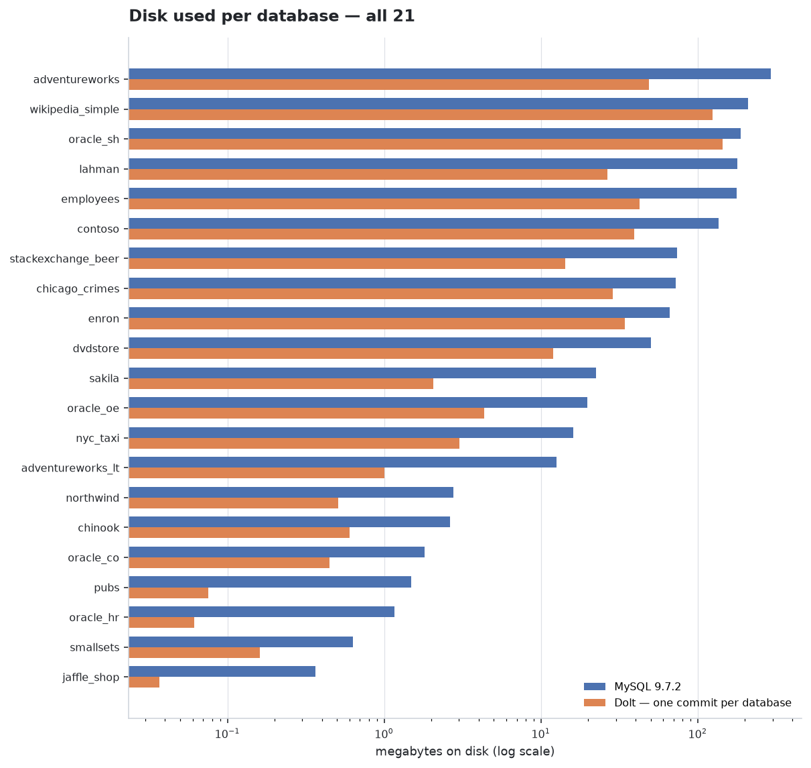

<!-- Generated by scripts/report.py from build/results.json.
     Do not edit by hand: `make report` overwrites it. -->

# Disk usage: MySQL 9.7.2 against Dolt 2.3.2

The same 21 sample databases, 9,056,697 rows, loaded into both engines from the same `mysqldump` files and measured the same way: `du -sb` of the directory each engine keeps the database in.

**Dolt uses 525.7 MB where MySQL uses 1.5 GB — 0.35× overall.** The ratio is not uniform: it ranges from 0.05× (`pubs`) to 0.76× (`oracle_sh`).

## Every database

`MySQL on disk` and `Dolt on disk` are directory sizes. `MySQL logical` is what
`information_schema` reports (`data_length + index_length`) — always smaller than the
directory, because it does not count free pages in the tablespace. `Dump` is the
`mysqldump` SQL both engines were loaded from, included as a size-independent reference
point for how much data is actually there.

| database | tables | rows | dump | MySQL logical | MySQL on disk | Dolt on disk | Dolt ÷ MySQL |
|---|---:|---:|---:|---:|---:|---:|---:|
| `adventureworks` | 69 | 759,240 | 89.6 MB | 119.3 MB | 292.2 MB | 48.8 MB | **0.17×** |
| `wikipedia_simple` | 9 | 1,167,112 | 73.6 MB | 64.7 MB | 208.2 MB | 123.7 MB | **0.59×** |
| `oracle_sh` | 9 | 1,063,396 | 49.8 MB | 1.7 MB | 188.4 MB | 143.4 MB | **0.76×** |
| `lahman` | 27 | 706,466 | 52.5 MB | 75.6 MB | 178.9 MB | 26.5 MB | **0.15×** |
| `employees` | 6 | 3,919,015 | 160.6 MB | 146.8 MB | 176.3 MB | 42.5 MB | **0.24×** |
| `contoso` | 8 | 753,467 | 65.1 MB | 103.3 MB | 135.3 MB | 39.4 MB | **0.29×** |
| `stackexchange_beer` | 11 | 62,523 | 15.0 MB | 6.1 MB | 73.6 MB | 14.2 MB | **0.19×** |
| `chicago_crimes` | 2 | 259,702 | 51.2 MB | 65.7 MB | 72.1 MB | 28.8 MB | **0.40×** |
| `enron` | 3 | 48,778 | 23.4 MB | 38.0 MB | 66.2 MB | 34.3 MB | **0.52×** |
| `dvdstore` | 9 | 174,716 | 7.4 MB | 16.3 MB | 50.0 MB | 11.9 MB | **0.24×** |
| `sakila` | 16 | 47,268 | 3.2 MB | 432.0 KB | 22.3 MB | 2.0 MB | **0.09×** |
| `oracle_oe` | 9 | 11,518 | 1.8 MB | 3.2 MB | 19.7 MB | 4.4 MB | **0.22×** |
| `nyc_taxi` | 2 | 48,591 | 6.6 MB | 10.1 MB | 16.1 MB | 3.0 MB | **0.19×** |
| `adventureworks_lt` | 12 | 4,277 | 1.9 MB | 4.1 MB | 12.6 MB | 1.0 MB | **0.08×** |
| `northwind` | 13 | 3,308 | 636.2 KB | 1.4 MB | 2.8 MB | 519.6 KB | **0.18×** |
| `chinook` | 11 | 15,607 | 457.0 KB | 1.6 MB | 2.6 MB | 615.0 KB | **0.23×** |
| `oracle_co` | 7 | 8,783 | 374.2 KB | 1.1 MB | 1.8 MB | 456.3 KB | **0.25×** |
| `pubs` | 11 | 255 | 122.0 KB | 176.0 KB | 1.5 MB | 77.0 KB | **0.05×** |
| `oracle_hr` | 7 | 216 | 29.7 KB | 112.0 KB | 1.2 MB | 62.8 KB | **0.05×** |
| `smallsets` | 4 | 2,147 | 231.2 KB | 64.0 KB | 644.0 KB | 164.3 KB | **0.26×** |
| `jaffle_shop` | 3 | 312 | 11.4 KB | 80.0 KB | 372.0 KB | 37.7 KB | **0.10×** |
| **total** | 248 | 9,056,697 | 603.5 MB | 660.0 MB | **1.5 GB** | **525.7 MB** | **0.35×** |

## Does it matter how the rows are written?

Two more loads of the same data answer two different questions. The first replaces mysqldump's extended `INSERT`s with **one `INSERT` per row**, keeping a single commit. The second commits **after every row**.

**Statement granularity changes nothing that is stored.** Across 11 databases the row-by-row load lands within 4.1% of the one-shot load, and within 0.0% at the median — noise from how chunks happen to pack, not a difference in what Dolt keeps. It costs a great deal of *time*: `dvdstore` takes 174,716 rows through 174,716 separate statements instead of a handful.

| database | rows | one commit, extended INSERTs | one commit, one INSERT per row | difference |
|---|---:|---:|---:|---:|
| `chicago_crimes` | 259,702 | 28.8 MB | 28.8 MB | -0.1% |
| `dvdstore` | 174,716 | 11.9 MB | 11.9 MB | +0.3% |
| `chinook` | 15,607 | 615.0 KB | 615.0 KB | +0.0% |
| `oracle_oe` | 11,518 | 4.4 MB | 4.2 MB | -4.1% |
| `oracle_co` | 8,783 | 456.3 KB | 456.3 KB | +0.0% |
| `adventureworks_lt` | 4,277 | 1.0 MB | 1.0 MB | +0.0% |
| `northwind` | 3,308 | 519.6 KB | 519.5 KB | -0.0% |
| `smallsets` | 2,147 | 164.3 KB | 164.3 KB | -0.0% |
| `jaffle_shop` | 312 | 37.7 KB | 37.7 KB | +0.0% |
| `pubs` | 255 | 77.0 KB | 77.0 KB | +0.0% |
| `oracle_hr` | 216 | 62.8 KB | 62.8 KB | -0.0% |

**Commit granularity changes everything.** The same rows, committed one at a time, take **1.0 GB where the one-commit load takes 7.2 MB** — 148× more, and 25× what MySQL uses for the same data. The worst case here is `oracle_oe`: 11,518 rows, 4.4 MB in one commit, 815.6 MB in 11,520 commits.

This is not overhead to be tuned away. It is what a version-controlled database is *for*: each commit is an addressable, diffable state of the whole database, and keeping a million of them costs what keeping a million of anything costs. The question it answers is not "is Dolt wasteful" but "what does my commit rate cost me", and the answer scales with commits, not rows.

| database | rows | MySQL | Dolt, one commit | Dolt, commit per row | commits | × one commit |
|---|---:|---:|---:|---:|---:|---:|
| `chinook` | 15,607 | 2.6 MB | 615.0 KB | 112.4 MB | 15,609 | **187×** |
| `oracle_oe` | 11,518 | 19.7 MB | 4.4 MB | 815.6 MB | 11,520 | **187×** |
| `oracle_co` | 8,783 | 1.8 MB | 456.3 KB | 68.4 MB | 8,785 | **153×** |
| `adventureworks_lt` | 4,277 | 12.6 MB | 1.0 MB | 37.5 MB | 4,279 | **37×** |
| `northwind` | 3,308 | 2.8 MB | 519.6 KB | 26.6 MB | 3,310 | **52×** |
| `smallsets` | 2,147 | 644.0 KB | 164.3 KB | 8.3 MB | 2,149 | **52×** |
| `jaffle_shop` | 312 | 372.0 KB | 37.7 KB | 738.6 KB | 314 | **20×** |
| `pubs` | 255 | 1.5 MB | 77.0 KB | 758.3 KB | 257 | **10×** |
| `oracle_hr` | 216 | 1.2 MB | 62.8 KB | 786.1 KB | 218 | **13×** |
| **these 9** | **46,423** | **43.1 MB** | **7.2 MB** | **1.0 GB** | | **148×** |

Scope: the per-row-commit load ran on the smallest databases only. At the measured rate it would need roughly 113 GB and several hours for all 9,056,697 rows, which buys no additional insight — the per-commit cost is already visible.

## Is the comparison valid?

Three things have to be true before a size ratio means anything. All three were checked on every database, not assumed.

**The same rows.** Every table counted with `COUNT(*)` on both sides before any size was recorded; `information_schema.table_rows` is an InnoDB estimate and is not used. **Every table matches.**

**The same indexes.** Indexes are a large part of what a database costs on disk, so each one is compared by definition — table, index name, column position, column, uniqueness — and not by count. **613 indexes in MySQL, 613 in Dolt, identical in every database.**

**The least history Dolt can hold.** Dolt is a versioned database, so how much history it keeps changes what it stores. The load makes exactly **one data commit per database** — `dolt_log` shows 3 commits, of which two are Dolt's own `Initialize data repository` and `CREATE DATABASE` — and `dolt_status` is clean afterwards, so nothing is sitting uncommitted where it would go unmeasured. Rows are not committed individually: the whole database arrives in one commit. **These numbers are therefore Dolt at its most favourable.** A branch, or a week of changes, would store more; this measures the floor.

## What is deliberately not counted

A running `dolt sql-server` writes a per-database **statistics repository** at `.dolt/stats` the first time it serves that database. Across these 21 databases it comes to **68.6 MB**, and `dolt gc` does not reclaim it. The largest is `adventureworks` at 68.2 MB — **more than the 48.8 MB of data it describes**.

It is excluded from every figure above, for two reasons: it is the query planner's working notes rather than the database, and it does not exist until someone starts a server — so counting it would make the answer depend on whether anyone had happened to connect first. It is real disk all the same, which is why it is stated here.

| database | data | server statistics |
|---|---:|---:|
| `adventureworks` | 48.8 MB | 68.2 MB |
| `chinook` | 615.0 KB | 22.0 KB |
| `contoso` | 39.4 MB | 22.0 KB |
| `enron` | 34.3 MB | 22.0 KB |
| `oracle_co` | 456.3 KB | 22.0 KB |
| `oracle_sh` | 143.4 MB | 22.0 KB |
| `nyc_taxi` | 3.0 MB | 22.0 KB |
| `stackexchange_beer` | 14.2 MB | 22.0 KB |
| `chicago_crimes` | 28.8 MB | 22.0 KB |
| `oracle_hr` | 62.8 KB | 22.0 KB |
| `pubs` | 77.0 KB | 22.0 KB |
| `northwind` | 519.6 KB | 22.0 KB |
| `dvdstore` | 11.9 MB | 22.0 KB |
| `employees` | 42.5 MB | 22.0 KB |
| `smallsets` | 164.3 KB | 22.0 KB |
| `wikipedia_simple` | 123.7 MB | 22.0 KB |
| `adventureworks_lt` | 1.0 MB | 22.0 KB |
| `jaffle_shop` | 37.7 KB | 22.0 KB |
| `sakila` | 2.0 MB | 22.0 KB |
| `lahman` | 26.5 MB | 22.0 KB |
| `oracle_oe` | 4.4 MB | 22.0 KB |

## Schema objects Dolt would not take

Views load once mysqldump's `ALGORITHM=` and `SQL SECURITY` clauses are removed. Stored functions do not load at all: Dolt rejects `CREATE FUNCTION`, and because one rejected statement aborts the rest of the routine section, a database loses all of its routines to the first function. None of this affects a row, which is why the counts above still match.

| database | views MySQL → Dolt | routines MySQL → Dolt |
|---|---|---|
| `adventureworks` | 13 → 12 | 0 → 0 |
| `adventureworks_lt` | 3 → 3 | 1 → 0 |
| `employees` | 4 → 4 | 7 → 0 |
| `oracle_co` | 3 → 2 | 0 → 0 |
| `oracle_oe` | 8 → 7 | 0 → 0 |
| `pubs` | 1 → 1 | 4 → 1 |
| `sakila` | 7 → 7 | 6 → 0 |

