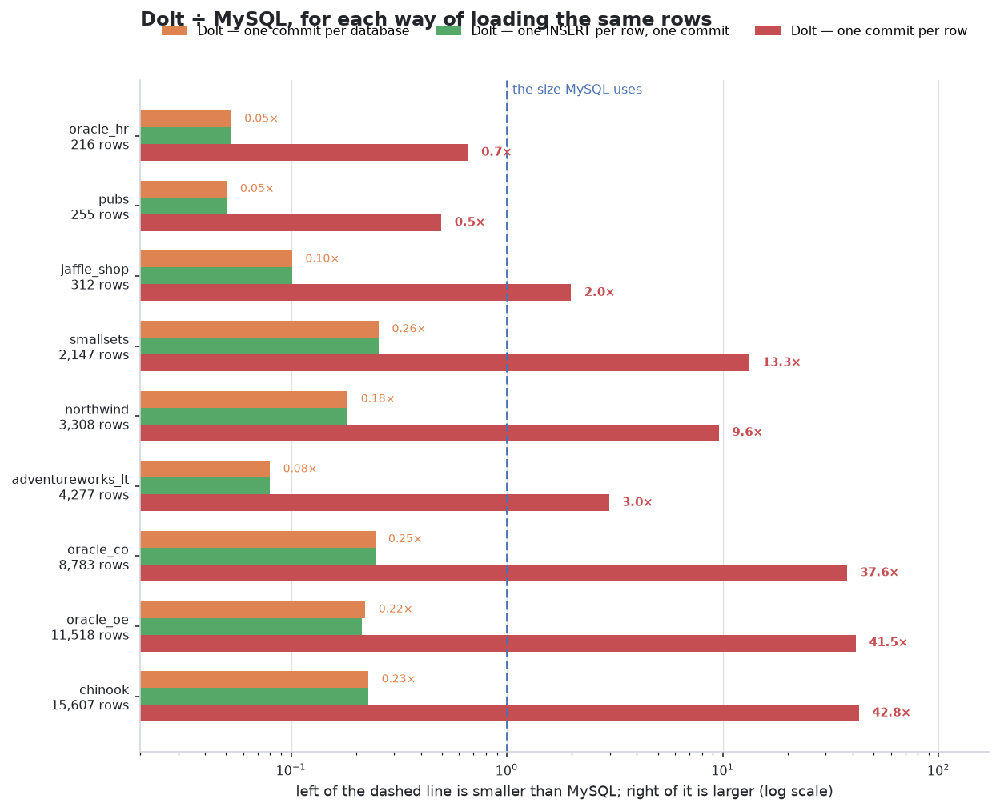
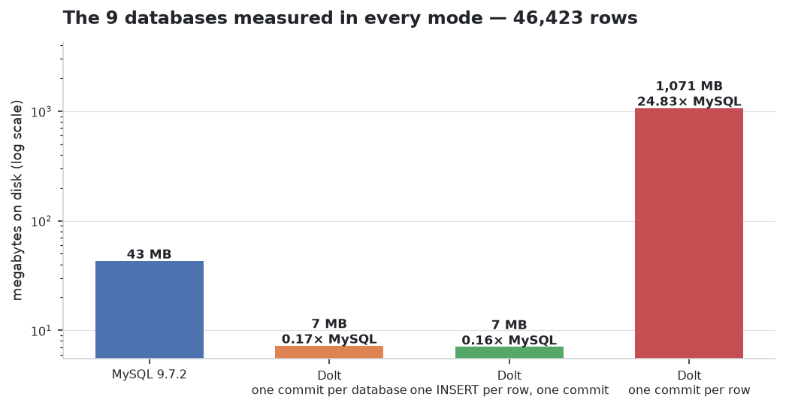
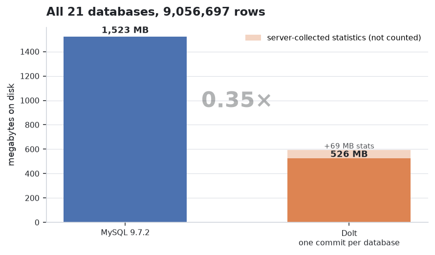
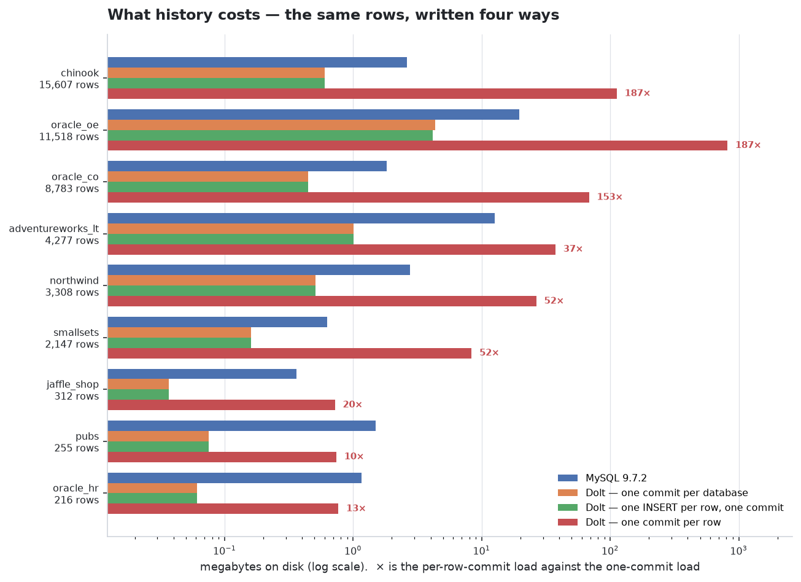

<!-- Generated by scripts/report.py from build/results.json.
     Do not edit by hand: `make report` overwrites it. -->

# Disk usage: MySQL 9.7.2 against Dolt 2.3.2

The same 21 sample databases, 9,056,697 rows, loaded into both engines from the same `mysqldump` files and measured the same way: `du -sb` of the directory each engine keeps the database in.

## The machine

| | |
|---|---|
| CPU | Intel(R) Core(TM) i9-14900KF (32 threads) |
| Memory | 19.5 GB |
| Disk | 1,006.9 GB ext4 |
| Kernel | 6.18.33.2-microsoft-standard-WSL2 |
| Docker | 29.7.2, storage driver `overlayfs` |
| MySQL | `mysql:9.7.2` — /usr/sbin/mysqld  Ver 9.7.2 for Linux on x86_64 (MySQL Community Server - GPL) |
| Dolt | `dolthub/dolt-sql-server` — dolt version 2.3.2 |
| Tuning | no performance tuning — stock images, stock storage settings; MySQL is started with the two flags below |
| MySQL flags | `--local-infile=1`, `--skip-log-bin` |

## The short answer: it depends on how you write the rows

Dolt is a version-controlled database, so *how* the rows arrive decides what it stores. Three loads of identical data give three different answers, and they are not close:

Both axes matter and they do not move together, so both are given for every load. MySQL is loaded from the same dumps into a fresh, empty server, and timed the same way.

| load | databases | disk | ÷ MySQL | time | ÷ MySQL |
|---|---:|---:|---:|---:|---:|
| **MySQL**, extended `INSERT`s | 21 | 1.8 GB | — | 67s | — |
| **Dolt**, one commit per database | 21 | 524.1 MB | **0.29×** | 269s | **4.0×** |
| **MySQL**, one `INSERT` per row | 21 | 1.5 GB | 0.86× | 1.2h | **66×** |
| **Dolt**, one `INSERT` per row | 21 | 530.0 MB | **0.29×** | 3.4h | **182×** |
| **Dolt**, one commit per row | 21 | 116.7 GB | **66×** | 8.3h | **447×** |

Read the two columns together. The standard Dolt load is a third of MySQL's disk for several times its load time — a trade, not a free win. Writing row by row is expensive in **both** engines, which is why MySQL is measured that way too: it separates what row-wise writing costs from what Dolt costs. And a commit per row is the one case where both axes go the wrong way at once.

## 1. One commit per database

The standard load. **524.1 MB against MySQL's 1.8 GB — 0.29×** over all 21 databases, and the ratio is not uniform: it runs from 0.05× (`pubs`) to 0.65× (`oracle_sh`), a spread of more than 13 to one.

The shape of the spread is legible. Small databases favour Dolt heavily because InnoDB allocates a tablespace per table whether or not anything is in it. Text-heavy data narrows the gap, because neither engine can compress prose. Dense numeric fact tables narrow it furthest — `oracle_sh` is close to InnoDB's best case.

## 2. One `INSERT` per row, still one commit

Replacing mysqldump's extended `INSERT`s with one statement per row changes the load completely and the result **not at all**: 13 of the 21 databases land within 0.5% of their one-shot size, and the widest differs by 16.8%. Against MySQL the two loads are indistinguishable — 0.29× against 0.29× on the same databases.

This is a real result rather than a non-event: statement batching is a load-time concern in Dolt exactly as it is in MySQL, and anyone reasoning about "row by row" storage costs is reasoning about the wrong granularity. It costs time — the largest database here goes through 3,919,015 separate statements.

| database | rows | MySQL | one commit | one INSERT per row | difference | vs MySQL |
|---|---:|---:|---:|---:|---:|---:|
| `employees` | 3,919,015 | 178.3 MB | 42.5 MB | 39.9 MB | -6.2% | **0.22×** |
| `wikipedia_simple` | 1,167,112 | 314.2 MB | 122.4 MB | 123.2 MB | +0.6% | **0.39×** |
| `oracle_sh` | 1,063,396 | 220.2 MB | 143.3 MB | 143.2 MB | -0.1% | **0.65×** |
| `adventureworks` | 759,240 | 335.9 MB | 49.2 MB | 49.2 MB | -0.1% | **0.15×** |
| `contoso` | 753,467 | 156.3 MB | 39.3 MB | 39.4 MB | +0.2% | **0.25×** |
| `lahman` | 706,466 | 191.8 MB | 26.3 MB | 26.3 MB | -0.2% | **0.14×** |
| `chicago_crimes` | 259,702 | 84.1 MB | 28.7 MB | 28.7 MB | +0.0% | **0.34×** |
| `dvdstore` | 174,716 | 60.0 MB | 11.9 MB | 12.4 MB | +3.9% | **0.21×** |
| `stackexchange_beer` | 62,523 | 83.6 MB | 14.0 MB | 16.1 MB | +15.1% | **0.19×** |
| `enron` | 48,778 | 98.2 MB | 34.1 MB | 38.6 MB | +13.0% | **0.39×** |
| `nyc_taxi` | 48,591 | 19.1 MB | 3.0 MB | 3.0 MB | +0.2% | **0.16×** |
| `sakila` | 47,268 | 24.1 MB | 2.0 MB | 2.2 MB | +7.6% | **0.09×** |
| `chinook` | 15,607 | 2.7 MB | 615.0 KB | 615.0 KB | -0.0% | **0.22×** |
| `oracle_oe` | 11,518 | 27.5 MB | 4.3 MB | 5.1 MB | +16.8% | **0.18×** |
| `oracle_co` | 8,783 | 1.8 MB | 456.3 KB | 456.1 KB | -0.0% | **0.24×** |
| `adventureworks_lt` | 4,277 | 12.5 MB | 1.0 MB | 1.0 MB | +0.0% | **0.08×** |
| `northwind` | 3,308 | 2.6 MB | 518.5 KB | 518.5 KB | -0.0% | **0.19×** |
| `smallsets` | 2,147 | 644.0 KB | 164.3 KB | 164.3 KB | +0.0% | **0.26×** |
| `jaffle_shop` | 312 | 372.0 KB | 37.7 KB | 37.7 KB | -0.0% | **0.10×** |
| `pubs` | 255 | 1.5 MB | 77.0 KB | 77.0 KB | +0.0% | **0.05×** |
| `oracle_hr` | 216 | 1.1 MB | 62.8 KB | 62.1 KB | -1.1% | **0.06×** |

## 3. One commit per row

The same rows with a commit after each one take **116.7 GB where the one-commit load takes 524.1 MB** — 228× more. Against MySQL the comparison **inverts**: those databases are 0.29× MySQL loaded normally and **66× MySQL** loaded a commit at a time, a swing of 228× from nothing but how the rows were written.

19 of the 21 end up larger than MySQL. The extreme is `employees`: 3,919,015 rows, 178.3 MB in MySQL, 42.5 MB in one Dolt commit, 63.3 GB in 0 — **363× MySQL for identical data**.

| database | rows | MySQL | one commit | ÷MySQL | one commit per row | ÷MySQL | × one commit |
|---|---:|---:|---:|---:|---:|---:|---:|
| `employees` | 3,919,015 | 178.3 MB | 42.5 MB | 0.24× | 63.3 GB | **363.4×** | 1524× |
| `wikipedia_simple` | 1,167,112 | 314.2 MB | 122.4 MB | 0.39× | 12.6 GB | **41.1×** | 105× |
| `oracle_sh` | 1,063,396 | 220.2 MB | 143.3 MB | 0.65× | 14.9 GB | **69.2×** | 106× |
| `adventureworks` | 759,240 | 335.9 MB | 49.2 MB | 0.15× | 7.2 GB | **21.8×** | 149× |
| `contoso` | 753,467 | 156.3 MB | 39.3 MB | 0.25× | 6.6 GB | **43.0×** | 171× |
| `lahman` | 706,466 | 191.8 MB | 26.3 MB | 0.14× | 6.5 GB | **34.8×** | 254× |
| `chicago_crimes` | 259,702 | 84.1 MB | 28.7 MB | 0.34× | 2.3 GB | **28.1×** | 82× |
| `dvdstore` | 174,716 | 60.0 MB | 11.9 MB | 0.20× | 1.7 GB | **29.4×** | 148× |
| `stackexchange_beer` | 62,523 | 83.6 MB | 14.0 MB | 0.17× | 435.8 MB | **5.2×** | 31× |
| `enron` | 48,778 | 98.2 MB | 34.1 MB | 0.35× | 357.9 MB | **3.6×** | 10× |
| `nyc_taxi` | 48,591 | 19.1 MB | 3.0 MB | 0.16× | 331.6 MB | **17.3×** | 110× |
| `sakila` | 47,268 | 24.1 MB | 2.0 MB | 0.08× | 300.3 MB | **12.5×** | 148× |
| `chinook` | 15,607 | 2.7 MB | 615.0 KB | 0.22× | 77.5 MB | **28.6×** | 129× |
| `oracle_oe` | 11,518 | 27.5 MB | 4.3 MB | 0.16× | 70.2 MB | **2.6×** | 16× |
| `oracle_co` | 8,783 | 1.8 MB | 456.3 KB | 0.24× | 39.1 MB | **21.4×** | 88× |
| `adventureworks_lt` | 4,277 | 12.5 MB | 1.0 MB | 0.08× | 20.1 MB | **1.6×** | 20× |
| `northwind` | 3,308 | 2.6 MB | 518.5 KB | 0.19× | 13.9 MB | **5.3×** | 27× |
| `smallsets` | 2,147 | 644.0 KB | 164.3 KB | 0.26× | 8.4 MB | **13.3×** | 52× |
| `jaffle_shop` | 312 | 372.0 KB | 37.7 KB | 0.10× | 658.2 KB | **1.8×** | 17× |
| `pubs` | 255 | 1.5 MB | 77.0 KB | 0.05× | 578.5 KB | **0.4×** | 8× |
| `oracle_hr` | 216 | 1.1 MB | 62.8 KB | 0.06× | 456.0 KB | **0.4×** | 7× |
| **these 21** | **9,056,697** | **1.8 GB** | **524.1 MB** | **0.29×** | **116.7 GB** | **66×** | **228×** |

This is not overhead to be tuned away. Each commit is an addressable, diffable state of the whole database, and keeping a million of them costs what keeping a million of anything costs. The question the number answers is not "is Dolt wasteful" but **"what does my commit rate cost me"**, and it scales with commits, not with rows.

## Every database, every load

`MySQL logical` is what `information_schema` reports (`data_length + index_length`) — always smaller than the directory, because it does not count free pages in the tablespace. `Dump` is the `mysqldump` SQL both engines were loaded from.

| database | tables | rows | dump | MySQL logical | MySQL | one commit | one INSERT/row | one commit/row |
|---|---:|---:|---:|---:|---:|---:|---:|---:|
| `adventureworks` | 69 | 759,240 | 89.6 MB | 119.3 MB | 335.9 MB | 49.2 MB **0.15×** | 49.2 MB **0.15×** | 7.2 GB **22×** |
| `wikipedia_simple` | 9 | 1,167,112 | 73.6 MB | 64.7 MB | 314.2 MB | 122.4 MB **0.39×** | 123.2 MB **0.39×** | 12.6 GB **41×** |
| `oracle_sh` | 9 | 1,063,396 | 49.8 MB | 1.7 MB | 220.2 MB | 143.3 MB **0.65×** | 143.2 MB **0.65×** | 14.9 GB **69×** |
| `lahman` | 27 | 706,466 | 52.5 MB | 75.6 MB | 191.8 MB | 26.3 MB **0.14×** | 26.3 MB **0.14×** | 6.5 GB **35×** |
| `employees` | 6 | 3,919,015 | 160.6 MB | 146.8 MB | 178.3 MB | 42.5 MB **0.24×** | 39.9 MB **0.22×** | 63.3 GB **363×** |
| `contoso` | 8 | 753,467 | 65.1 MB | 103.3 MB | 156.3 MB | 39.3 MB **0.25×** | 39.4 MB **0.25×** | 6.6 GB **43×** |
| `enron` | 3 | 48,778 | 23.4 MB | 38.0 MB | 98.2 MB | 34.1 MB **0.35×** | 38.6 MB **0.39×** | 357.9 MB **3.64×** |
| `chicago_crimes` | 2 | 259,702 | 51.2 MB | 65.7 MB | 84.1 MB | 28.7 MB **0.34×** | 28.7 MB **0.34×** | 2.3 GB **28×** |
| `stackexchange_beer` | 11 | 62,523 | 15.0 MB | 6.1 MB | 83.6 MB | 14.0 MB **0.17×** | 16.1 MB **0.19×** | 435.8 MB **5.21×** |
| `dvdstore` | 9 | 174,716 | 7.4 MB | 16.3 MB | 60.0 MB | 11.9 MB **0.20×** | 12.4 MB **0.21×** | 1.7 GB **29×** |
| `oracle_oe` | 9 | 11,518 | 1.8 MB | 3.2 MB | 27.5 MB | 4.3 MB **0.16×** | 5.1 MB **0.18×** | 70.2 MB **2.55×** |
| `sakila` | 16 | 47,268 | 3.2 MB | 432.0 KB | 24.1 MB | 2.0 MB **0.08×** | 2.2 MB **0.09×** | 300.3 MB **12×** |
| `nyc_taxi` | 2 | 48,591 | 6.6 MB | 10.1 MB | 19.1 MB | 3.0 MB **0.16×** | 3.0 MB **0.16×** | 331.6 MB **17×** |
| `adventureworks_lt` | 12 | 4,277 | 1.9 MB | 4.1 MB | 12.5 MB | 1.0 MB **0.08×** | 1.0 MB **0.08×** | 20.1 MB **1.61×** |
| `chinook` | 11 | 15,607 | 457.0 KB | 1.6 MB | 2.7 MB | 615.0 KB **0.22×** | 615.0 KB **0.22×** | 77.5 MB **29×** |
| `northwind` | 13 | 3,308 | 636.2 KB | 1.4 MB | 2.6 MB | 518.5 KB **0.19×** | 518.5 KB **0.19×** | 13.9 MB **5.27×** |
| `oracle_co` | 7 | 8,783 | 374.2 KB | 1.1 MB | 1.8 MB | 456.3 KB **0.24×** | 456.1 KB **0.24×** | 39.1 MB **21×** |
| `pubs` | 11 | 255 | 122.0 KB | 176.0 KB | 1.5 MB | 77.0 KB **0.05×** | 77.0 KB **0.05×** | 578.5 KB **0.39×** |
| `oracle_hr` | 7 | 216 | 29.7 KB | 112.0 KB | 1.1 MB | 62.8 KB **0.06×** | 62.1 KB **0.06×** | 456.0 KB **0.41×** |
| `smallsets` | 4 | 2,147 | 231.2 KB | 64.0 KB | 644.0 KB | 164.3 KB **0.26×** | 164.3 KB **0.26×** | 8.4 MB **13×** |
| `jaffle_shop` | 3 | 312 | 11.4 KB | 80.0 KB | 372.0 KB | 37.7 KB **0.10×** | 37.7 KB **0.10×** | 658.2 KB **1.77×** |
| **total** | 248 | 9,056,697 | 603.5 MB | 660.0 MB | **1.8 GB** | **524.1 MB 0.29×** | | |

## Is the comparison valid?

Six things have to be true before a size ratio means anything. All six were checked on every database, not assumed. Three of them are checks on the data, below; the other three are properties of how the load is run, and each is here because it was once false: both engines are given the identical transformed dump (MySQL used to read mysqldump's original), every Dolt load ends with a commit and a clean `dolt_status` (the per-row-commit load used to end with `dolt gc` alone, leaving the index rebuild uncommitted), and every size is taken after `dolt gc` so a journal is never measured in place of a store.

**The same rows.** `COUNT(*)` on both sides, per table, before any size was recorded; `information_schema.table_rows` is an InnoDB estimate and is not used. **21 database(s) disagree**: `adventureworks`, `adventureworks_lt`, `chicago_crimes`, `chinook`, `contoso`, `dvdstore`, `employees`, `enron`, `jaffle_shop`, `lahman`, `northwind`, `nyc_taxi`, `oracle_co`, `oracle_hr`, `oracle_oe`, `oracle_sh`, `pubs`, `sakila`, `smallsets`, `stackexchange_beer`, `wikipedia_simple`

**The same indexes.** Compared by definition — table, index name, column position, column, uniqueness — not by count. **21 database(s) differ**: `adventureworks`, `adventureworks_lt`, `chicago_crimes`, `chinook`, `contoso`, `dvdstore`, `employees`, `enron`, `jaffle_shop`, `lahman`, `northwind`, `nyc_taxi`, `oracle_co`, `oracle_hr`, `oracle_oe`, `oracle_sh`, `pubs`, `sakila`, `smallsets`, `stackexchange_beer`, `wikipedia_simple`

Checked for every load, not only the one-shot one. The deferred policy takes the secondary indexes out of `CREATE TABLE` and rebuilds them with `ALTER TABLE` after the last row, so "the same indexes at the end" is exactly the thing it could get wrong:

| Dolt load | databases checked | indexes in MySQL | indexes in Dolt | disagreements |
|---|---:|---:|---:|---|
| one commit per database | 21 | 613 | 0 | `adventureworks`, `adventureworks_lt`, `chicago_crimes`, `chinook`, `contoso`, `dvdstore`, `employees`, `enron`, `jaffle_shop`, `lahman`, `northwind`, `nyc_taxi`, `oracle_co`, `oracle_hr`, `oracle_oe`, `oracle_sh`, `pubs`, `sakila`, `smallsets`, `stackexchange_beer`, `wikipedia_simple` |
| one `INSERT` per row, indexes deferred | 21 | 613 | 0 | `adventureworks`, `adventureworks_lt`, `chicago_crimes`, `chinook`, `contoso`, `dvdstore`, `employees`, `enron`, `jaffle_shop`, `lahman`, `northwind`, `nyc_taxi`, `oracle_co`, `oracle_hr`, `oracle_oe`, `oracle_sh`, `pubs`, `sakila`, `smallsets`, `stackexchange_beer`, `wikipedia_simple` |
| one commit per row, indexes deferred | 21 | 613 | 0 | `adventureworks`, `adventureworks_lt`, `chicago_crimes`, `chinook`, `contoso`, `dvdstore`, `employees`, `enron`, `jaffle_shop`, `lahman`, `northwind`, `nyc_taxi`, `oracle_co`, `oracle_hr`, `oracle_oe`, `oracle_sh`, `pubs`, `sakila`, `smallsets`, `stackexchange_beer`, `wikipedia_simple` |
| one `INSERT` per row, indexes maintained | 21 | 613 | 0 | `adventureworks`, `adventureworks_lt`, `chicago_crimes`, `chinook`, `contoso`, `dvdstore`, `employees`, `enron`, `jaffle_shop`, `lahman`, `northwind`, `nyc_taxi`, `oracle_co`, `oracle_hr`, `oracle_oe`, `oracle_sh`, `pubs`, `sakila`, `smallsets`, `stackexchange_beer`, `wikipedia_simple` |
| one commit per row, indexes maintained | 21 | 613 | 0 | `adventureworks`, `adventureworks_lt`, `chicago_crimes`, `chinook`, `contoso`, `dvdstore`, `employees`, `enron`, `jaffle_shop`, `lahman`, `northwind`, `nyc_taxi`, `oracle_co`, `oracle_hr`, `oracle_oe`, `oracle_sh`, `pubs`, `sakila`, `smallsets`, `stackexchange_beer`, `wikipedia_simple` |

**The history is stated, not assumed.** The one-commit load makes exactly one data commit per database (`dolt_log` shows , two of them Dolt's own `Initialize data repository` and `CREATE DATABASE`), and `dolt_status` is clean afterwards. That is the least history Dolt can hold, which is why section 3 exists: it measures the other end.

## What a running server adds, and why it is not in the figures

Every size above was measured with **no server running**: the load is done by the `dolt` CLI and nothing serves the data afterwards. That is deliberate. A `dolt sql-server` writes a per-database statistics repository at `.dolt/stats`, `dolt gc` does not reclaim it, and mixing served and unserved directories is how an earlier version of this experiment produced a total that moved by 68 MB between runs for no visible reason.

Measured on a copy: starting a server and reading every table in every database wrote **0 B** in total, an even 22 KB per database.

**That is a floor, not the cost.** During this project's own console use — four web clients browsing the data over a working session — `adventureworks`'s statistics reached **68.2 MB, more than the 49.2 MB of data they describe**. A single pass over every table does not reproduce that, so the growth is driven by sustained querying in a way this experiment has not characterised. It is recorded because it is real disk that a real deployment will use, and because 22 KB would be a misleading thing to remember.

## What maintaining the indexes costs

Tests 2, 4 and 5 run twice: once with the secondary indexes and foreign keys dropped for the load and rebuilt afterwards, and once with every index maintained on every row. Everything else is identical, including the final schema. A positive number means keeping the indexes cost more.

### MySQL, one `INSERT` per row

| database | disk, deferred | disk, inline | change | time, deferred | time, inline | change |
|---|---:|---:|---:|---:|---:|---:|
| `employees` | 176.3 MB | 178.3 MB | +1.1% | 1,850s | 1,846s | -0.2% |
| `wikipedia_simple` | 235.2 MB | 402.2 MB | +71.0% | 582s | 606s | +4.1% |
| `oracle_sh` | 188.4 MB | 220.2 MB | +16.9% | 510s | 552s | +8.3% |
| `adventureworks` | 311.0 MB | 335.9 MB | +8.0% | 394s | 406s | +3.0% |
| `contoso` | 135.3 MB | 156.3 MB | +15.5% | 369s | 380s | +3.0% |
| `lahman` | 178.9 MB | 191.8 MB | +7.3% | 347s | 355s | +2.3% |
| `chicago_crimes` | 72.1 MB | 84.1 MB | +16.6% | 134s | 143s | +6.3% |
| `dvdstore` | 50.0 MB | 60.1 MB | +20.2% | 84s | 85s | +1.5% |
| `stackexchange_beer` | 73.6 MB | 88.6 MB | +20.4% | 33s | 35s | +4.5% |
| `enron` | 66.2 MB | 134.2 MB | +102.7% | 30s | 31s | +3.0% |
| `nyc_taxi` | 16.1 MB | 19.1 MB | +18.6% | 25s | 26s | +1.6% |
| `sakila` | 22.3 MB | 24.1 MB | +8.1% | 23s | 24s | +5.2% |
| `chinook` | 2.6 MB | 2.7 MB | +3.6% | 8s | 8s | +1.3% |
| `oracle_oe` | 19.6 MB | 27.6 MB | +41.1% | 7s | 7s | -1.4% |
| `oracle_co` | 1.8 MB | 1.8 MB | +2.6% | 5s | 5s | +2.2% |
| `adventureworks_lt` | 11.5 MB | 12.5 MB | +8.4% | 4s | 3s | -26.3% |
| `northwind` | 2.7 MB | 2.6 MB | -1.8% | 3s | 2s | -25.9% |
| `smallsets` | 644.0 KB | 644.0 KB | +0.0% | 1s | 1s | +0.0% |
| `jaffle_shop` | 372.0 KB | 372.0 KB | +0.0% | 0s | 0s | +0.0% |
| `pubs` | 1.5 MB | 1.5 MB | +0.0% | 1s | 0s | -33.3% |
| `oracle_hr` | 1.1 MB | 1.1 MB | +0.0% | 1s | 0s | -50.0% |
| **21 databases** | **1.5 GB** | **1.9 GB** | **+24.2%** | **1.2h** | **1.3h** | **+2.4%** |

### Dolt, one `INSERT` per row, one commit

| database | disk, deferred | disk, inline | change | time, deferred | time, inline | change |
|---|---:|---:|---:|---:|---:|---:|
| `employees` | 39.9 MB | 39.3 MB | -1.5% | 1.4h | 1.4h | +1.0% |
| `wikipedia_simple` | 123.2 MB | 113.9 MB | -7.5% | 1,568s | 1,898s | +21.0% |
| `oracle_sh` | 143.2 MB | 135.5 MB | -5.3% | 1,475s | 2,111s | +43.1% |
| `adventureworks` | 49.2 MB | 48.9 MB | -0.6% | 1,269s | 1,502s | +18.3% |
| `contoso` | 39.4 MB | 39.3 MB | -0.3% | 926s | 1,061s | +14.6% |
| `lahman` | 26.3 MB | 26.4 MB | +0.6% | 953s | 1,019s | +7.0% |
| `chicago_crimes` | 28.7 MB | 28.8 MB | +0.2% | 359s | 520s | +44.7% |
| `dvdstore` | 12.4 MB | 11.9 MB | -3.8% | 216s | 251s | +16.7% |
| `stackexchange_beer` | 16.1 MB | 14.0 MB | -13.3% | 90s | 119s | +32.4% |
| `enron` | 38.6 MB | 34.3 MB | -11.1% | 90s | 183s | +103.0% |
| `nyc_taxi` | 3.0 MB | 3.0 MB | +0.1% | 65s | 79s | +21.0% |
| `sakila` | 2.2 MB | 2.0 MB | -7.9% | 68s | 82s | +20.5% |
| `chinook` | 615.0 KB | 615.0 KB | +0.0% | 19s | 21s | +10.5% |
| `oracle_oe` | 5.1 MB | 4.2 MB | -17.3% | 18s | 33s | +88.6% |
| `oracle_co` | 456.1 KB | 456.3 KB | +0.0% | 11s | 12s | +10.1% |
| `adventureworks_lt` | 1.0 MB | 1.0 MB | -0.0% | 6s | 6s | +10.3% |
| `northwind` | 518.5 KB | 518.5 KB | +0.0% | 5s | 6s | +19.6% |
| `smallsets` | 164.3 KB | 164.3 KB | +0.0% | 3s | 3s | -3.3% |
| `jaffle_shop` | 37.7 KB | 37.7 KB | +0.0% | 1s | 0s | -28.6% |
| `pubs` | 77.0 KB | 77.0 KB | -0.0% | 1s | 1s | +0.0% |
| `oracle_hr` | 62.1 KB | 62.8 KB | +1.1% | 1s | 1s | +0.0% |
| **21 databases** | **530.0 MB** | **504.4 MB** | **-4.8%** | **3.4h** | **3.9h** | **+14.9%** |

### Dolt, one commit per row

| database | disk, deferred | disk, inline | change | time, deferred | time, inline | change |
|---|---:|---:|---:|---:|---:|---:|
| `employees` | 63.3 GB | 67.7 GB | +7.1% | 3.5h | 4.2h | +17.8% |
| `wikipedia_simple` | 12.6 GB | 28.2 GB | +123.9% | 1.0h | 1.3h | +28.5% |
| `oracle_sh` | 14.9 GB | 56.0 GB | +276.4% | 3,517s | 1.5h | +55.5% |
| `adventureworks` | 7.2 GB | 15.0 GB | +109.5% | 3,454s | 1.9h | +97.5% |
| `contoso` | 6.6 GB | 11.1 GB | +69.6% | 2,181s | 2,726s | +25.0% |
| `lahman` | 6.5 GB | 8.7 GB | +34.0% | 2,257s | 2,579s | +14.3% |
| `chicago_crimes` | 2.3 GB | 10.4 GB | +349.6% | 768s | 1,105s | +43.9% |
| `dvdstore` | 1.7 GB | 3.3 GB | +93.6% | 493s | 575s | +16.6% |
| `stackexchange_beer` | 435.8 MB | 2.0 GB | +361.5% | 188s | 260s | +38.5% |
| `enron` | 357.9 MB | 5.9 GB | +1576.3% | 161s | 376s | +133.1% |
| `nyc_taxi` | 331.6 MB | 923.2 MB | +178.4% | 134s | 162s | +20.8% |
| `sakila` | 300.3 MB | 690.4 MB | +129.9% | 156s | 206s | +31.9% |
| `chinook` | 77.5 MB | 114.3 MB | +47.5% | 45s | 51s | +14.6% |
| `oracle_oe` | 70.2 MB | 816.5 MB | +1062.4% | 36s | 70s | +96.1% |
| `oracle_co` | 39.1 MB | 66.6 MB | +70.2% | 24s | 27s | +12.3% |
| `adventureworks_lt` | 20.1 MB | 38.0 MB | +89.0% | 13s | 14s | +10.8% |
| `northwind` | 13.9 MB | 26.9 MB | +93.9% | 11s | 12s | +17.0% |
| `smallsets` | 8.4 MB | 8.3 MB | -0.6% | 6s | 6s | +0.0% |
| `jaffle_shop` | 658.2 KB | 735.4 KB | +11.7% | 1s | 2s | +7.1% |
| `pubs` | 578.5 KB | 794.4 KB | +37.3% | 2s | 1s | -6.7% |
| `oracle_hr` | 456.0 KB | 823.1 KB | +80.5% | 1s | 1s | +0.0% |
| **21 databases** | **116.7 GB** | **211.0 GB** | **+80.9%** | **8.3h** | **11.2h** | **+34.6%** |

## Schema objects Dolt would not take

Views load once mysqldump's `ALGORITHM=` and `SQL SECURITY` clauses are removed. Stored functions do not load at all: Dolt rejects `CREATE FUNCTION`, and because one rejected statement aborts the rest of the routine section, a database loses all of its routines to the first function. None of this affects a row, which is why the counts above still match.

| database | views MySQL → Dolt | routines MySQL → Dolt |
|---|---|---|
| `adventureworks` | 13 → 0 | 0 → 0 |
| `adventureworks_lt` | 3 → 0 | 1 → 0 |
| `dvdstore` | 0 → 0 | 2 → 0 |
| `employees` | 4 → 0 | 7 → 0 |
| `enron` | 1 → 0 | 0 → 0 |
| `northwind` | 16 → 0 | 6 → 0 |
| `nyc_taxi` | 3 → 0 | 0 → 0 |
| `oracle_co` | 3 → 0 | 0 → 0 |
| `oracle_hr` | 1 → 0 | 0 → 0 |
| `oracle_oe` | 8 → 0 | 0 → 0 |
| `oracle_sh` | 3 → 0 | 0 → 0 |
| `pubs` | 1 → 0 | 4 → 0 |
| `sakila` | 7 → 0 | 6 → 0 |
| `stackexchange_beer` | 2 → 0 | 0 → 0 |
| `wikipedia_simple` | 4 → 0 | 0 → 0 |

